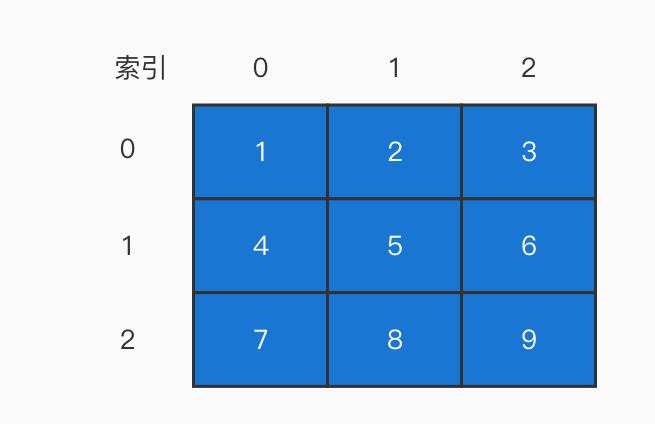

# 数据结构(一)

数据结构层面，我们大概只需要掌握这几种：

- 数组
- 栈
- 队列
- 链表
- 树（重点是二叉树）

## 数组

数组是我们需要认识的第一个数据结构。

作为最简单，最基础的数据结构，数组在很多语言中都有原生的表达，例如在 JavaScript 中，我们可以开箱即用的对数组进行使用。

虽然我们平时开发中对**数组**这一数据结构大量的使用，但是仍要注意：**需要对数组这一数据结构额外小心**。

### 数组的创建

平时我们创建数组一般都是这样的：

```js
const arr = [1, 2, 3]
```

但是在算法中，一般我们并不知道数组中存放的元素，或者需要创建一个定长的空（固定值）的数组，所以还可以这样创建：

```js
// 创建一个定长的空数组
const arr = new Array(7)
// 创建一个定长的固定值的数组
const arr2 = new Array(7).fill(1)
```

### 数组的访问和遍历

一般我们可以通过数据的索引来访问数组中的元素：

```js
arr[1]
```

遍历数组大概有以下的几种方式：

- for
- while
- for in
- for of
- forEach

从性能上来看，`for` 和 `while` 的性能是最高的，所以在算法中，如无特殊需求，一般使用 `for` 来遍历数组。

### 多维数组

虽然我们日常开发中很难接触到多维数组，但是这里还是提一嘴

多维数组使用最多的就是二维数组，一个二维数组大概是张这个样子的：

```js
const arr = [
  [1, 2, 3],
  [4, 5, 6],
  [7, 8, 9]
]
```

那么反映到图中就是这样的：



从形状上来看，一维数组像是一条线，而二维数组就是一个面了，像是一个矩形。

**所以算法中的矩阵就是通过二维数组中实现**，这个大家一定要记得，矩阵 === 二维数组。

### 二维数组的初始化

#### fill 的局限性

有的时候，你想图省事，就可以使用 `fill` 来初始化二维数组:

```js
const arr = new Array(6).fill(2)
```

但是当你想修改某一项的值得时候：

```js
arr[0][0] = 1
```

你会发现所有的值都变成了 1。这就是 `fill` 的局限性，当你填入的实参是引用类型时，那么其实填入的是引用类型的引用。也就是 6 个数组都指向同一块内存空间，那么修改一个其实就修改了所有。

#### 初始化

那么本着安全高效的方式，我们推荐使用 `for` 来创建二维数组：

```js
const arr = new Array(7)
const len = arr.length
for (let i = 0; i < len; i++)
  arr[i] = []
```

### 二维数组的访问

通过多层循环的方式来访问二维数组中的每一项：

```js
// 缓存外部数组的长度
const outerLen = arr.length
for (let i = 0; i < outerLen; i++) {
  // 缓存内部数组的长度
  const innerLen = arr[i].length
  for (let j = 0; j < innerLen; j++) {
    // 输出数组的值，输出数组的索引
    console.log(arr[i][j], i, j)
  }
}
```

## 总结

在 JS 所有的数据结构中，数组可谓是基石般的存在，本章只是讲了数组的基本信息。
