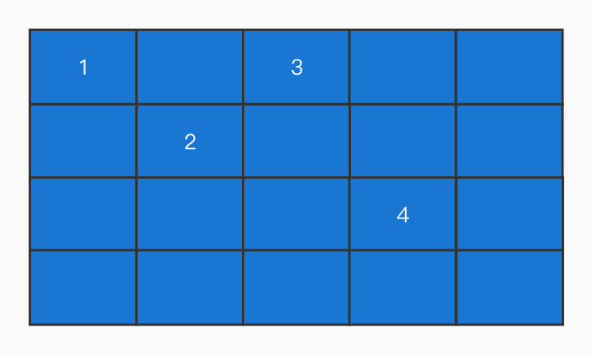

# 数据结构 (二)

本节将基于数组的基础，我们来学习一些线性数据结构（队列、栈、链表）

## 栈和队列

在 JS 中，栈和队列都通过数组来实现，因此可以将这两者看成是 “特别” 的数组。
(实际上，栈和队列作为两个运算受限的线性数据结构，可以通过链表来实现，只不过从前端面试做题的角度来说，使用链表实现未免过于麻烦）

栈和队列两者的区别在于，他们对于增删改查的有着不同的限制。因此我们在学习栈和队列之前，可以先来明确一下数据的增删改查具有怎样的特性，以及对应的方法有哪些。

### 增加元素

有三种方式可以向数组中增加元素：

- `unshift`: 增加到头部
- `push`: 增加到尾部
- `splice`: 增加到任意位置

```js
const arr = [1]
arr.unshift(2) // [2, 1]
arr.push(3) // [2, 1, 3]
arr.splice(1, 0, 4) // [2, 4, 1, 3]
```

这里可以重点说一下 `splice`, 我们对于 splice 一般都是用于删除操作：

```js
const arr = [1, 2]
arr.splice(1, 1)
```

那么如果是存在第三个参数，那么就表明是需要插入的元素：

```js
// 从索引 1，删除 0 个元素，插入元素 3
arr.splice(1, 0, 3)
```

### 删除元素

可以使用三种方式来删除一个元素：

- `shift`: 删除头部的元素
- `pop`: 删除尾部的元素
- `splice`: 删除任意位置的元素

### 栈 (Stack) 只用 `push` 和 `pop` 来增删元素的“数组”

栈是一种后进先出 (LIFO) 的数据结构。栈像是一个箱子，当一个箱子装满了东西，你如果想要拿最下面的东西，只能把上面的东西一个一个取出来。

- 只允许从尾部添加元素
- 只允许从尾部取出元素

一般来说，栈相关的面试题还有取出栈顶元素操作，不难看出，所谓栈顶元素其实就是 “数组” 最后的一个元素。

下面我们可以通过模拟来实现一个栈的增删。

```js
const stack = []

// 入栈过程
stack.push(1)
stack.push(2)

// 出栈过程
while (stack.length) {
  // 访问当前栈顶的元素（不出栈）
  console.log(stack[stack.length - 1])
  // 出栈
  stack.pop()
}
```

### 队列 (Queue) 只用 `push` 和 `shift` 完成增删的 “数组”

队列是一种先进先出 (FIFO) 的数据结构。队列像是管道，从尾部进入的元素，会首先从头部出来。

- 只允许从尾部添加元素
- 只允许从头部取出元素

所以我们可以通过 `push` 和 `unshift` 来完成对队列的增删。

下面我们来模拟一下：

```js
const queue = []

// 增加元素
queue.push(1)
queue.push(2)

// 消费元素
while (queue.length) {
  // 访问元素（不出队）
  console.log(queue[0])
  // 移除元素
  queue.unshift()
}
```

## 链表

链表和数组很相似，他们都是有序的结构，都是线性结构（有且仅有一个前驱，有且仅有一个后继）。

不同点在于，链表中，数据单元的名称叫做 **结点**，而结点与结点的分布在内存中可以是 **离散** 的。

这个 “离散” 是相对于数组中的 “连续” 而说的。

我们来看看一个数组：


数组在内存中最为关键的一个特征，就是它一般是对应一段位于自己上界与下界之间的、一段连续的内存空间。元素与元素之间，紧紧相连。(当然，还会有另外一种情况，这个下文中会说)

而链表的结点，则允许散落在内存中的各个角落。一个内容是 `1 -> 2 -> 3 -> 4` 的链表，在内存中的表现可能是这样的：



正是因为数组的元素是连续的，每个元素的内存地址可以根据其索引距头部的距离算出来。因此对于数组来说，可以通过其索引来获取值。

但是对于链表来说，元素之间在内存上似乎毫无瓜葛。加入我们站在 1 的角度上，根本无从知晓 2 3 4 的内存地址，那么根本就无法遍历。

既然没有关联，我们就要创造关联。在链表中，每一个结点的结构包含了两部分：**数据域** 和 **指针域**。JS 中的链表，是以嵌套对象的形式来实现的：

```js
const linkedList = {
  // 数据域
  val: 1,
  // 指针域，指向下一个结点
  next: {
    val: 2,
    // ...
  }
}
```

数据域储存的是当前结点所储存的数据值，而指针域则代表下一个结点（后继结点）的引用。有了 next 来指向下一个结点，独立的结点之间就有了联系：


要想访问链表中的某个结点，就得从头结点开始，通过 `next` 依次访问下一个结点，直到访问到那个结点为止。有时候为了确保起始结点是可达的，我们还会设定一个 `head` 指针专门指向头结点。


### 链表结点的创建

创建一个链表结点，我们需要一个构造函数：

```js
function ListNode(val) {
  this.val = val
  this.next = null
}
```

在使用构造函数创建结点时，传入 val（数据域中的内容），执行 next（下一个结点）即可：

```js
const node = new ListNode(1)
node.next = new ListNode(2)
```

这样就创建一个 `1 -> 2` 的链表

### 链表元素的添加

我们已经知道，链表是通过 `next` 来维护结点之间的关系的，所以元素的添加和删除操作，都要通过 `next` 来实现。

先来说一说添加，添加只需要给末尾结点的 next 设定一个新的结点即可向链表中添加了一个新的元素。


值得注意的是添加的一种特殊情况：如何在两个结点之间添加一个结点？

要想完成这个操作，我们需要更改前驱节点和目标节点的 `next` 指向：


```js
const node = new ListNode(1)
node.next = new ListNode(2)

// 如何在 1 和 2 之间添加 3
const newNode = new ListNode(3)
// 先将 2 提出来
const tempNode = node.next
// 将前驱节点的 next 指向 3
node.next = newNode
// 再将目标节指的 next 指向 2
newNode.next = tempNode
```

### 链表元素的删除

删除也非常简单，延续上文的思路，删除只需要让前驱节点的 next 指向目标节点的下一个结点即可。


```js
const node = new ListNode(1)
node.next = new ListNode(3)
node.next.next = new ListNode(2)

// 删除 3 结点
const tempNode = node.next.next
node.next = tempNode
```

在这里需要提个醒：**在做链表相关题时，重要的不是目标结点，而是目标结点的前驱节点**

## 链表和数组的辨析

在大多数的计算机语言中，数组都对应着一段连续的内存。如果我们想要在任意位置删除一个元素，那么该往后的所有元素，都需要向前移动一个位置。相应的，如果是添加，那么都需要向后移动一个位置。

我们假设一个数组的长度为 n，那么因添加/删除操作导致需要移动的元素的数量，都会随着 n 的增大而增大，呈一个线性关系。所以数组的增删操作对应的复杂度就是 O(n)。

但 JS 不一定是。JS 比较特别，如果我们在数组中只定义了一种类型的元素：

```js
const arr = [1, 2, 3]
```

它是一个纯数字数组，那么对应的就是连续内存。但是如果我们存放了不同类型的元素：

```js
const arr = [true, null, 1, 'string', { a: 1 }]
```

它对应的就是一段非连续的内存。此时，JS 数组不再具有数组的特征，其底层使用**哈希映射**分配内存空间，是由**对象链表**实现的。

理解起来比较绕，只需要记住 JS 中的数组未必是真正的数组即可。

那么何为“真正的数组”？在百科中对于数组的定义：都有这一个“储存在连续的内存空间中”这样的必要条件。因此在本文中，我们描述的 “数组” 就是符合这个定义的数组。面试时，若考到数组和链表的辨析，大家也沿着这个思路往下说，是没有问题的。如果能够说出 JS 数组和常规数组的不同，那就是锦上添花了。

相较于数组来说，链表有着一个明显的优点，那就是**添加和删除元素**都不需要挪动多余的元素。

### 高效的增删操作

在链表中，添加和删除的复杂度是固定的——不管链表的结点个数 n 有多大，只要我们明确了要插入、删除的位置，那么我们需要做的就仅仅是改变目标结点的前驱节点、后继节点的指针指向。

因此我们说链表的增删的复杂度是常数级别的，用大 O 法表示就是 O(1)。

### 麻烦的访问操作

但是链表也有一个弊端：当我们试图读取一个特定的链表结点时，需要遍历整个链表查找。假设我们在一个长度为 n(n > 10) 的链表中，定位它的第 10 个结点，需要这样做：

```js
// 记录目标结点的位置
const index = 10
// 设一个游标指向链表第一个结点，从第一个结点开始遍历
let node = head
// 反复遍历到第10个结点为止
for (let i = 0; i < index && node; i++)
  node = node.next
```

随着链表的不断增大，搜索的范围也会变大。这个变化呈线性规律，用大 O 发表示则为 O(N)。

但在数组中，我们可以直接通过索引来访问值，那么操作的复杂度就会被降低为常数级别，即 O(1)。

```js
arr[1]
```

## 总结

综上所述，我们得出结论：链表的插入/删除效率高，而访问效率低，数组反之。这个特定需要记住，可以作为数据结构选型的重要参考依据。
