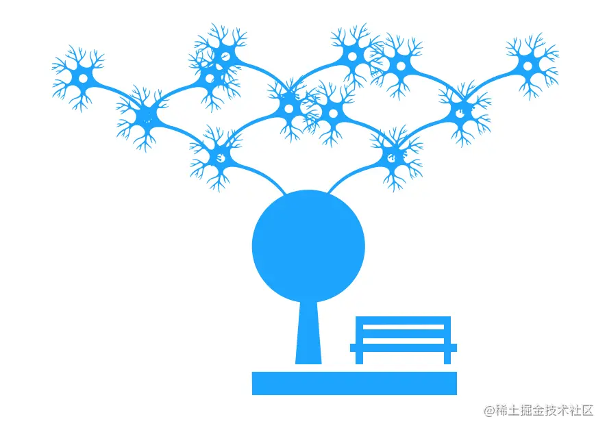

# 数据结构(三)

本节我们来认识一下树与二叉树

## 理解树结构

在理解计算机世界的树结构之前，大家不妨回忆一下现实世界中的树有什么特点：一棵树往往只有一个树根，向上生长后，却可以伸展出无数的树枝、树枝上会长出树叶。由树根从泥土中吸收水、无机盐等营养物质，源源不断地输送到树枝与树叶的那一端。一棵树往往呈现这样的基本形态：



数据结构中的树，首先是对现实世界中树的一层简化：把树根抽象为 “根结点”，树枝抽象为 “边”，树枝的两个端点抽象为 “结点”，树叶抽象为 “叶子结点”。抽象后的树结构如下：


把这棵抽象后的树颠倒一下，就得到了计算机中的树结构：


结合这张图，我们来理解一下树的关键特性和重要概念：

- **树的层次计算规则**：根结点所在那一层被记为第一层，其子结点就是第二层，以此类推。
- **结点和树的“高度”计算规则**：叶子结点高度记为 1，每向上一层高度就加 1，逐层向上累加至目标结点时，所得到的的值就是目标结点的高度。树中结点的最大高度，称为 “树的高度”。
- **度的概念**：一个结点开叉出去多少子树，被记为树的“度”。比如上图中，根结点的度是 3。
- **叶子结点**：叶子结点就是度为 0 的结点。在图中，最后一层的结点的度都为 0，所以这一层的所有结点都是叶子结点。

## 理解二叉树结构

二叉树是满足下面条件的树：

- 它可以没有根结点，作为一棵空树存在
- 如果它不是空树，那么必须由根结点、左子树和右子树组成，且左右子树都是二叉树。


> 注意：二叉树不能定义为每个结点的度都是 2 的树。普通的树并不会区分左子树和右子树。
>
> 但在二叉树中，左右子树的位置是严格约定，不能交换的。对应在图中看出，B 和 C，D 和 E，F 和 G 都是不能互换的。

## 二叉树的编码实现

在 JS 中，二叉树使用对象来定义，它的结构分为三块：

- 数据域
- 左侧子结点（左子树根结点）的引用
- 右侧子结点（右子树根结点）的引用

在定义二叉树时，我们需要将左右子结点预留为空：

```js
// 二叉树结点的构造函数
function TreeNode(val) {
  this.val = val
  this.left = this.right = null
}
```

当创建一个二叉树结点时，直接调用函数，传入数据域的值即可：

```js
const node = new TreeNode(1)
```

如此可得到一个值为 1 的二叉树结点。从结构上来看，它长这样：


以这个结点为根，我们可以通过给 `left/right` 赋值拓展其子树类型，延展出一个二叉树。从更细化的角度来看，一棵二叉树的形态实际上是这样的：


