# 递归初相见-二叉树的递归遍历的三种方式

我们之前学过数组、链表的遍历，这种线性结构的遍历考起来没有什么难点，所以一般不会单独出题。

但是二叉树就不一样了，这一“开叉”，他的遍历难度陡然上了一个台阶。在面试中，二叉树的各种姿势遍历，是非常容易作为单独命题来考察的。

这里我对大家的要求就是 “在理解的基础上记忆”。如果你真的暂时理解不了，背也要先给你自己背下来，然后带着对正确思路的记忆，重新去看解析部分里的图文（尤其是图）、反复去理解，这么整下来你不可能学不会。

面试时见到二叉树的遍历，你不能再去想太多 —— 没有那么多时间给你现场推理，这么熟悉的题目你没必要现场推理，你要做的是默写！默写啊！老哥们！！（捶胸顿足）

## 二叉树遍历 - 命题思路解读

以一定的顺序规则，逐个访问二叉树的所有结点，这个过程就是二叉树的遍历。按照顺序规则的不同，遍历方式有以下几种：

- 先序遍历
- 中序遍历
- 后序遍历
- 层次遍历

按照实现的不同，遍历方式又分为了两种：

- 递归遍历（先、中、后序遍历）
- 迭代遍历（层次遍历）

层次遍历的考察相对孤立，我们会放在后文中说。这里我们重点要看的是先、中、后序遍历三兄弟 —— 由于同时纠结了二叉树和 “递归” 两个大热命题点，又不属于 “偏难怪” 之流，遍历三兄弟一直是前端算法面试官们的心头好，考察热度经久不衰。

## 递归遍历初相见

> 编程语言中，函数 Func (Type a,……) 直接或间接调用函数本身，则该函数称为递归函数。

简单来说，当我们看到一个函数在反复调用它自己的时候，递归就发生了。“递归”意味着“反复”。像咱们之前对二叉树的定义，就可以理解为是一个递归式的定义：

- 它可以没有根结点，作为一棵空树存在
- 如果它不是空树，那么必须由根结点、左子树和右子树组成，且左右子树都是二叉树

这个定义有着这样的内涵：如果我们想要创建一个二叉树结点作为根结点，那么它左侧的子结点和右侧的子结点也都必须符合二叉树结点的定义，这意味着我们要反复地执行 “创建一个由数据域、左右子树组成的结点” 这个动作，直到数据被分配完为止。

结合这个定义来看，每一棵二叉树都应该由这三部分组成：

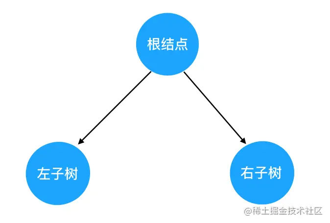

对树的遍历，就可以看做是对这三个部分的遍历。这里就引出一个问题：三个部分中，到底先遍历哪个、后遍历哪个呢？

我们此处其实可以穷举一下，假如在保证 “左子树一定先于右子树遍历” 这个前提，那么遍历的可能顺序也不过三种：

- 根节点 -> 左子树 -> 右子树
- 左子树 -> 根节点 -> 右子树
- 左子树 -> 右子树 -> 根节点

上面这三种顺序，就分别对应了二叉树的先序、中序和后序遍历规则。

在这三种顺序中，根结点的遍历分别被安排在了首要位置、中间位置和最后位置。

所谓的 “先序”、“中序” 和 “后序”，“先”、“中”、“后” 其实就是指根结点的遍历时机。

## 遍历方法图解与编码实现

### 先序遍历

先序遍历的 “旅行路线” 如下图红色数字 所示：

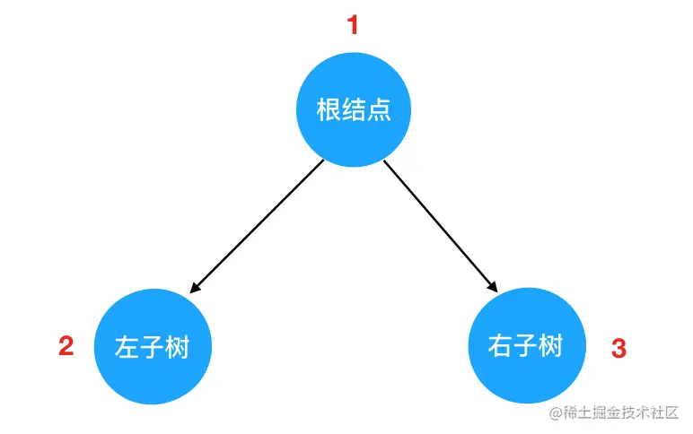

如果说有 N 多个子树，那么我们在每一棵子树内部，都要重复这个 “旅行路线”，动画演示如下：

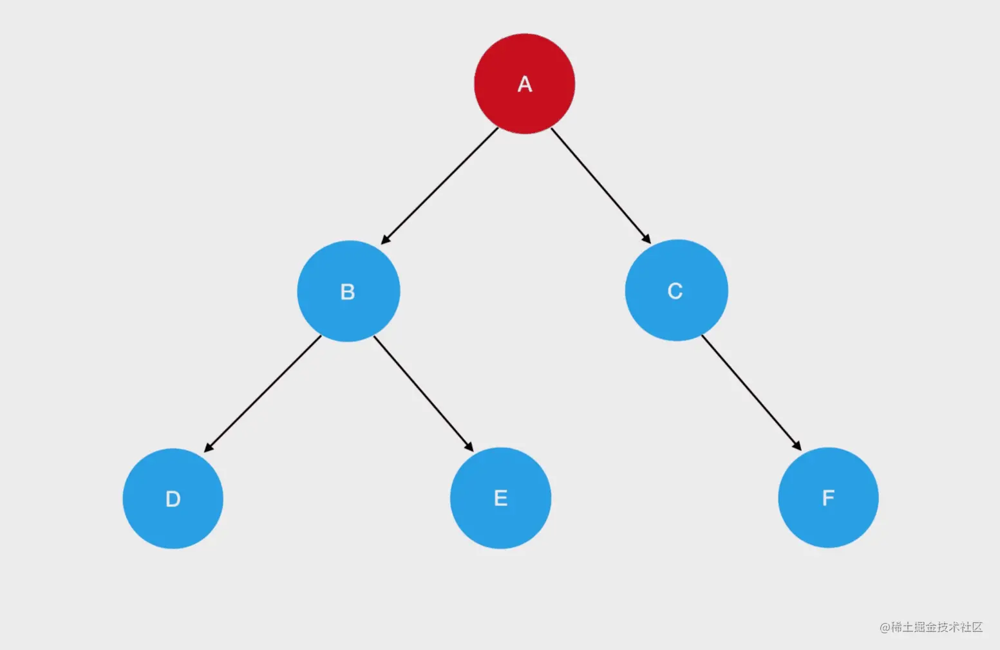

这个 “重复”，我们就用递归来实现。

至于此时二叉树的结构，是这样的：

```js
const root = {
  val: 'A',
  left: {
    val: 'B',
    left: {
      val: 'D',
      left: null,
      right: null
    },
    right: {
      val: 'E',
      left: null,
      right: null
    }
  },
  right: {
    val: 'C',
    left: null,
    right: {
      val: 'F',
      left: null,
      right: null
    }
  }
}
```

#### 递归函数的编写要点

编写一个递归函数之前，需要确认两个东西：

- 递归边界
- 递归式

递归式，指的是每一次重复的内容是什么。在这里，就是每一次从 `根节点 -> 左子树 -> 右子树` 的过程

递归边界，指的是什么时候停下来。在遍历的场景中，一般是遇到值为空时，就需要停下来，一般停下来需要 `return` 一些东西。

### 第一个递归遍历函数

我们来看看先序遍历的编码实现：

```js
// 所有遍历函数的入参都是树的根结点对象
function preOrder(root) {
  // 递归边界，root 为空
  if (!root)
    return
  // 输出当前遍历的结点值
  console.log('当前遍历的结点值是：', root.val)
  // 递归遍历左子树
  preOrder(root.left)
  // 递归遍历右子树
  preOrder(root.right)
}
```

觉得递归很难理解？我们来解析一下运行过程：

#### 图解先序遍历的全过程

我们回过头来看一下示例的二叉树：

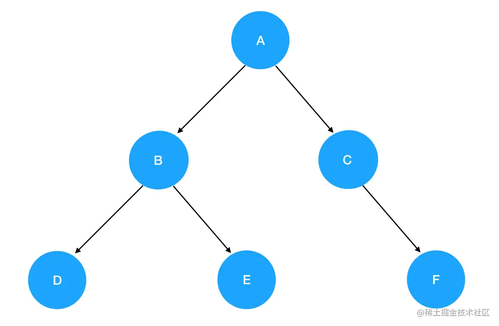

我们直接把它套进 `preOrder` 函数里，一步一步来认清楚先序遍历的每一步做了什么：

1. 调用 `preOrder(root)` 这里的 root 就是 `A`，他非空，所以进入递归式，输出 A 值。接着开始遍历左子树，`preOrder(root.left)`。此时就是 `preOrder(B)`

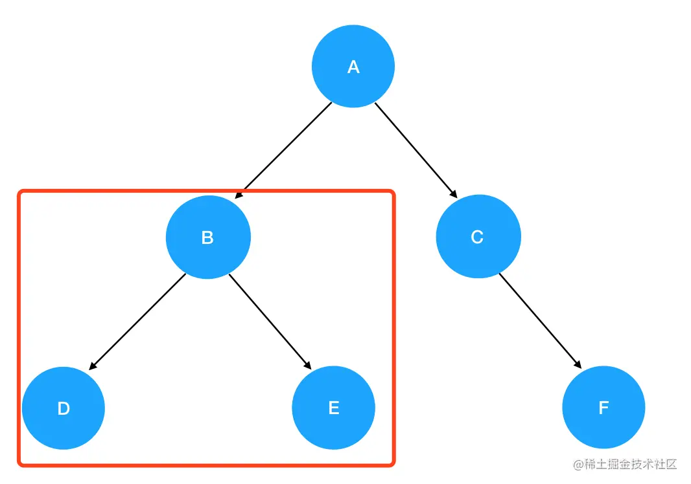

2. 进入 `preOrder(B)` 的逻辑： 入参为结点 B，非空，进入递归式，输出 B 值。接着优先遍历 B 的左子树，`preOrder(root.left)` 此时为 `preOrder(D)` ：

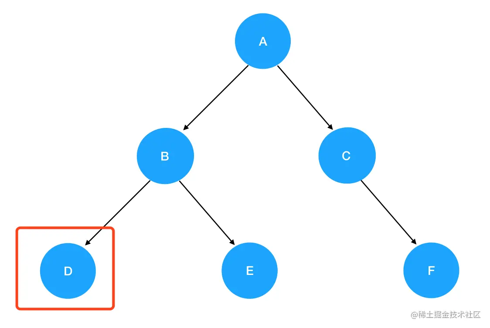

3. 进入 `preOrder(D)` 的逻辑： 入参为结点 D，非空，进入递归式，输出 D 值。接着优先遍历 D 的左子树，`preOrder(root.left)` 此时为 `preOrder(null)`

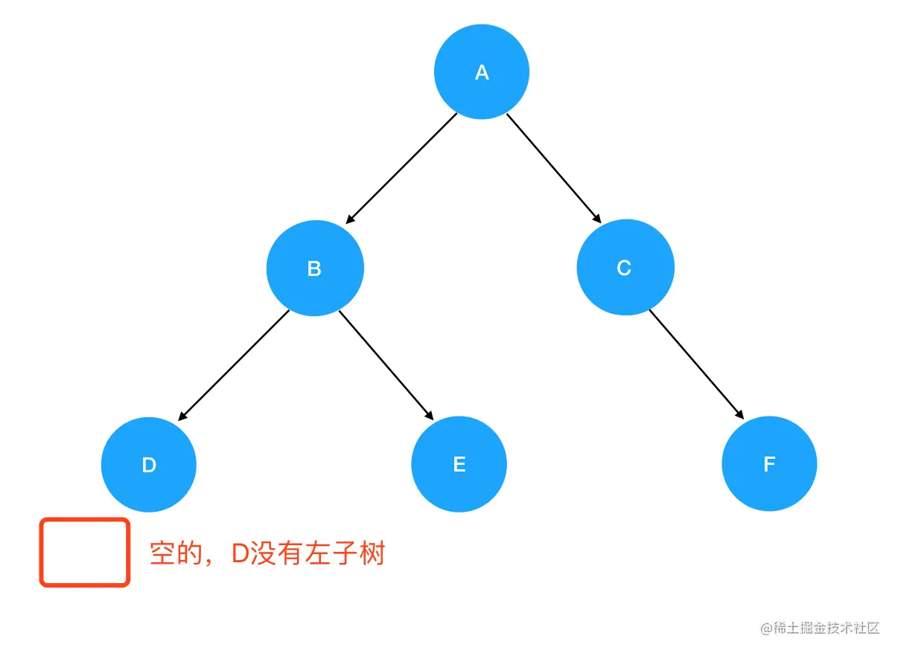

4. 进入 `preOrder(null)` ，发现抵达了递归边界，直接 return 掉。紧接着是 `preOrder(D)` 的逻辑往下走，走到了 `preOrder(root.right)` ：

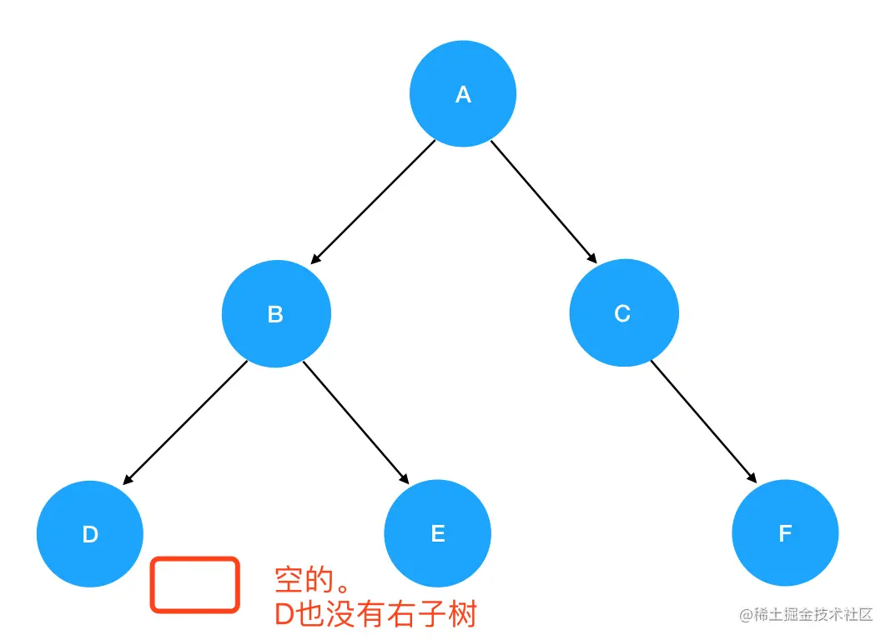

5. ...... 按照这样的递归顺序依次类推，就得到了如下结果：

```js
A
B
D
E
C
F
```

### 中序遍历

理解了先序遍历的过程，中序遍历就不是什么难题。唯一的区别只是把遍历顺序调换了`左子树 -> 根结点 -> 右子树`：

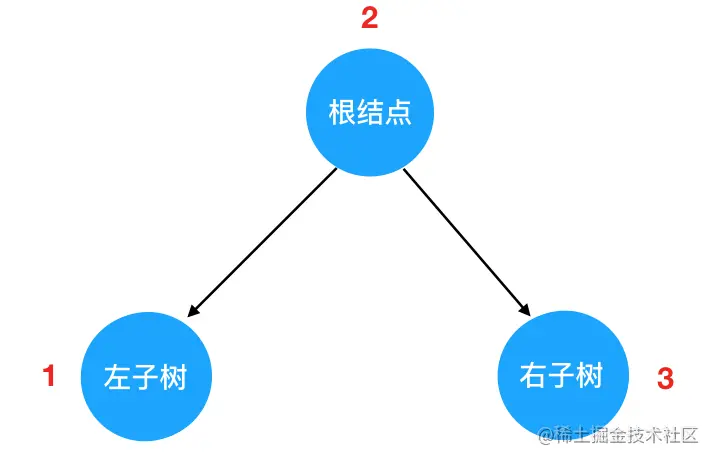

若有多个子树，那么我们在每一棵子树内部，都要重复这个 “旅行路线”，这个过程用动画表示如下：

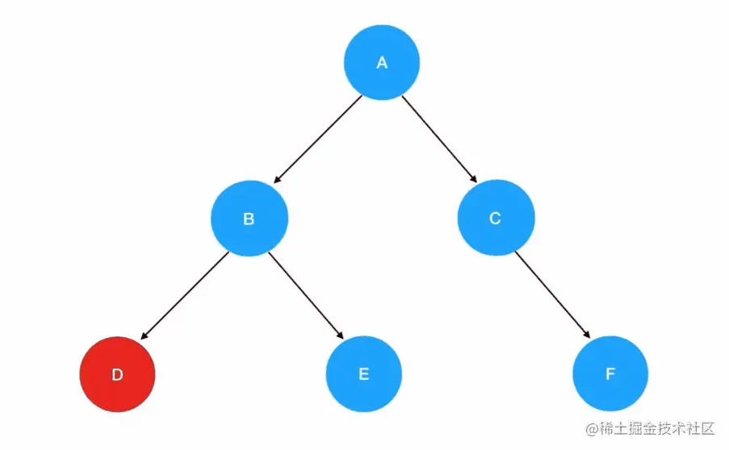

递归边界照旧，唯一发生改变的是递归式里调用递归函数的顺序 —— 左子树的访问会优先于根结点。我们参考先序遍历的分析思路，来写中序遍历的代码：

```js
// 所有遍历函数的入参都是树的根结点对象
function inOrder(root) {
  // 递归边界，root 为空
  if (!root)
    return
  // 递归遍历左子树
  inOrder(root.left)
  // 输出当前遍历的结点值
  console.log('当前遍历的结点值是：', root.val)
  // 递归遍历右子树
  inOrder(root.right)
}
```

按照中序遍历的逻辑，同样的一棵二叉树，结点内容的输出顺序如下：

```js
D
B
E
A
C
F
```

### 后序遍历

在后序遍历中，我们先访问左子树，再访问右子树，最后访问根结点：

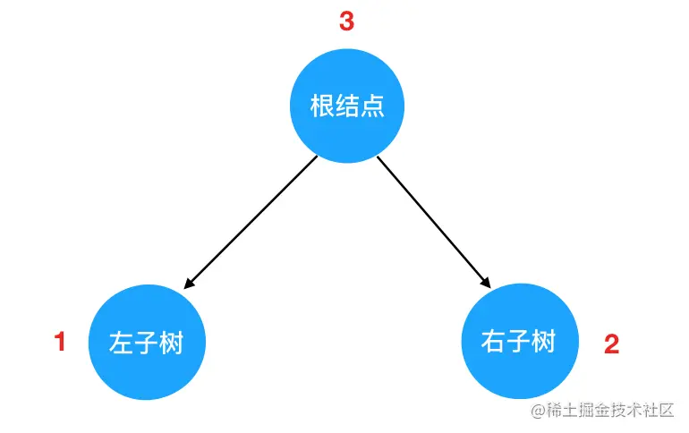

若有多个子树，那么我们在每一棵子树内部，都要重复这个 “旅行路线”：

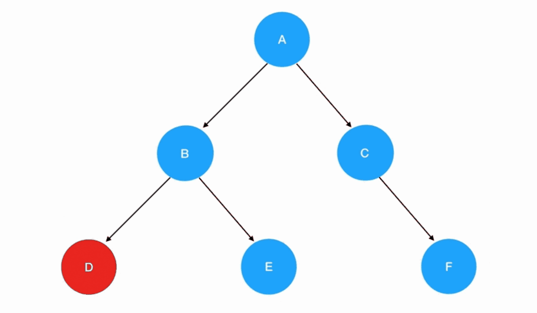

这样我们就能写出后序遍历的代码

```js
function postOrder(root) {
  if (!root) return
  postOrder(root.left)
  postOrder(root.right)
  console.log('当前遍历的结点值是：', root.val)
}
```

输出的结果是：

```js
D
E
B
F
C
A
```

## 总结

对于二叉树的先、中、后序遍历，各位只要掌握了其中一种的思路，就可以举一反三、顺势推导其它三种思路。不过建议，仍然是以 “默写” 的标准来要求自己，面试时不要指望 “推导”，而应该有条件反射。

这样才可以尽量地提高你做题的效率，为后面真正的难题、综合性题目腾出时间。
