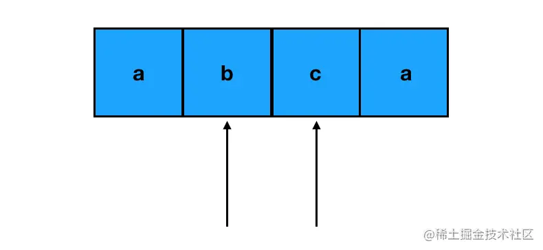
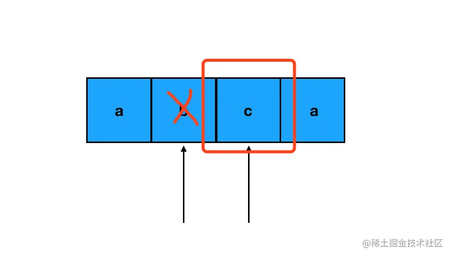

# 算法中字符串的应用

字符串在算法面试中，单独考察的机会并不多，同样倾向于和一些经典算法（后面会讲的）结合来体现区分度。

## 基本算法技能

### 反转字符串

在 JS 中，反转字符串我们直接调相关 API 即可，相信不少同学都能手到擒来：

```js
// 定义被反转的字符串
const str = 'juejin'
// 定义反转后的字符串
const res = str.split('').reverse().join('')
console.log(res) // nijeuj
```

（这段代码需要你非常熟悉，一些公司一面为了试水，有时会单独考这个操作）。

### 判断一个字符串是否是回文字符串

回文字符串，就是正着读和倒着读都一样的字符串，比如这样的：

```
'yessey'
```

结合这个定义，我们不难写出一个判定回文字符串的方法：

```js
function isPalindrome(str) {
  // 先反转字符串
  const reversedStr = str.split('').reverse().join('')
  // 判断反转前后是否相等
  return reversedStr === str
}
```

同时，回文字符串还有另一个特性：如果从中间位置 “劈开”，那么两边的两个子串在内容上是完全对称的。因此我们也可以结合对称性来做判断：

```js
function isPalindrome(str) {
  // 缓存字符串的长度
  const len = str.length
  // 遍历前半部分，判断和后半部分是否对称
  for (let i = 0; i < len / 2; i++) {
    if (str[i] !== str[len - i - 1])
      return false

  }
  return true
}
```

（谨记这个对称的特性，非常容易用到）

## 高频真题解读

### 回文字符串的衍生问题

> 真题描述：给定一个非空字符串 s，最多删除一个字符。判断是否能成为回文字符串。
>
> 示例 1: 输入: "aba"
>
> 输出: True
>
> 示例 2:
>
> 输入: "abca"
>
> 输出: True
>
> 解释：你可以删除 c 字符。
>
> 注意：字符串只包含从 a-z 的小写字母。字符串的最大长度是 50000。

#### 思路分析

这道题很多同学第一眼看过去，可能本能地会想到这样一种解法：若字符串本身不回文，则直接遍历整个字符串。遍历到哪个字符就删除哪个字符、同时对删除该字符后的字符串进行是否回文的判断，看看存不存在删掉某个字符后、字符串能够满足回文的这种情况。

这个思路真的实现起来的话，在判题系统眼里其实也是没啥毛病的。但是在面试官看来，就有点问题了 —— 这不是一个高效的解法。
如何判断自己解决回文类问题的解法是否 “高效”？其中一个很重要的标准，就是看你对回文字符串的对称特性利用得是否彻底。

字符串题干中若有 “回文” 关键字，那么做题时脑海中一定要冒出两个关键字 —— **对称性** 和 **双指针**。这两个工具一起上，足以解决大部分的回文字符串衍生问题。

回到这道题上来，我们首先是初始化两个指针，一个指向字符串头部，另一个指向尾部：


如果两个指针所指的字符恰好相等，那么这两个字符就符合了回文字符串对对称性的要求，跳过它们往下走即可。如果两个指针所指的字符串不等，比如这样：



那么就意味着不对称发生了，意味着这是一个可以 “删掉试试看” 的操作点。

我们可以分别对左指针字符和右指针字符尝试进行 “跳过”，看看区间在 `[left+1, right]` 或 `[left, right-1]` 的字符串是否回文。如果是的话，那么就意味着如果删掉被 “跳过” 那个字符，整个字符串都将回文：



比如说这里我们跳过了 b，`[left+1, right]` 的区间就是 `[2, 2]`，它对应 c 这个字符，单个字符一定回文。这样一来，删掉 b 之后，左右指针所指的内部区间是回文的，外部区间也是回文的，可以认为整个字符串就是一个回文字符串了。

#### 编码实现

```js
const validPalindrome = function (s) {
  // 缓存字符串的长度
  const len = s.length

  // i、j分别为左右指针
  let i = 0; let j = len - 1

  // 当左右指针均满足对称时，一起向中间前进
  while (i < j && s[i] === s[j]) {
    i++
    j--
  }

  // 尝试判断跳过左指针元素后字符串是否回文
  if (isPalindrome(i + 1, j))
    return true

  // 尝试判断跳过右指针元素后字符串是否回文
  if (isPalindrome(i, j - 1))
    return true

  // 工具方法，用于判断字符串是否回文
  function isPalindrome(st, ed) {
    while (st < ed) {
      if (s[st] !== s[ed])
        return false

      st++
      ed--
    }
    return true
  }

  // 默认返回 false
  return false
}
```

### 字符串匹配问题 —— 正则表达式初相见

接下来我们来看一道综合性比较强的字符串大题：

```
真题描述： 设计一个支持以下两种操作的数据结构：
void addWord(word)
bool search(word)
search (word) 可以搜索文字或正则表达式字符串，字符串只包含字母 . 或 a-z 。
. 可以表示任何一个字母。

示例: addWord ("bad")
addWord("dad")
addWord("mad")
search("pad") -> false
search("bad") -> true
search(".ad") -> true
search("b..") -> true
说明:
你可以假设所有单词都是由小写字母 a-z 组成的。
```

#### 思路分析

这道题要求字符串既可以被添加、又可以被搜索，这就意味着字符串在添加时一定要被存在某处。键值对存储，我们用 Map（或对象字面量来模拟 Map）。

注意，这里为了降低查找时的复杂度，我们可以考虑以字符串的长度为 key，相同长度的字符串存在一个数组中，这样可以提高我们后续定位的效率。

难点在于 search 这个 API，它既可以搜索文字，又可以搜索正则表达式。因此我们在搜索前需要额外判断一下，传入的到底是普通字符串，还是正则表达式。若是普通字符串，则直接去 Map 中查找是否有这个 key；若是正则表达式，则创建一个正则表达式对象，判断 Map 中相同长度的字符串里，是否存在一个能够与这个正则相匹配。

这里需要大家复习一下正则表达式的创建，以及用于测试某个字符串是否与之匹配的方法：

```js
/**
 * 构造函数
 */
const WordDictionary = function () {
  // 初始化一个对象字面量，承担 Map 的角色
  this.words = {}
}

/**
  添加字符串的方法
 */
WordDictionary.prototype.addWord = function (word) {
  // 若该字符串对应长度的数组已经存在，则只做添加
  if (this.words[word.length]) {
    this.words[word.length].push(word)
  }
  else {
    // 若该字符串对应长度的数组还不存在，则先创建
    this.words[word.length] = [word]
  }

}

/**
  搜索方法
 */
WordDictionary.prototype.search = function (word) {
  // 若该字符串长度在 Map 中对应的数组根本不存在，则可判断该字符串不存在
  if (!this.words[word.length])
    return false

  // 缓存目标字符串的长度
  const len = word.length
  // 如果字符串中不包含‘.’，那么一定是普通字符串
  if (!word.includes('.')) {
    // 定位到和目标字符串长度一致的字符串数组，在其中查找是否存在该字符串
    return this.words[len].includes(word)

  }

  // 否则是正则表达式，要先创建正则表达式对象
  const reg = new RegExp(word)

  // 只要数组中有一个匹配正则表达式的字符串，就返回true
  return this.words[len].some((item) => {
    return reg.test(item)
  })
}
```

### 正则表达式更进一步 —— 字符串与数字之间的转换问题

```
真题描述：请你来实现一个 atoi 函数，使其能将字符串转换成整数。
首先，该函数会根据需要丢弃无用的开头空格字符，直到寻找到第一个非空格的字符为止。
当我们寻找到的第一个非空字符为正或者负号时，则将该符号与之后面尽可能多的连续数字组合起来，作为该整数的正负号；假如第一个非空字符是数字，则直接将其与之后连续的数字字符组合起来，形成整数。
该字符串除了有效的整数部分之后也可能会存在多余的字符，这些字符可以被忽略，它们对于函数不应该造成影响。
注意：假如该字符串中的第一个非空格字符不是一个有效整数字符、字符串为空或字符串仅包含空白字符时，则你的函数不需要进行转换。
在任何情况下，若函数不能进行有效的转换时，请返回 0。

说明： 假设我们的环境只能存储 32 位大小的有符号整数，那么其数值范围为 [−2^31,  2^31 − 1]。如果数值超过这个范围，请返回  INT_MAX (2^31 − 1) 或 INT_MIN (−2^31) 。

示例 1:
输入: "42"
输出: 42

示例 2:
输入: "-42"
输出: -42
解释：第一个非空白字符为 '-', 它是一个负号。
我们尽可能将负号与后面所有连续出现的数字组合起来，最后得到 -42 。
示例 3: 输入: "4193 with words"
输出: 4193
解释：转换截止于数字 '3' ，因为它的下一个字符不为数字。

示例 4: 输入: "words and 987"
输出: 0
解释：第一个非空字符是 'w', 但它不是数字或正、负号。 因此无法执行有效的转换。

示例 5:
输入: "-91283472332"
输出: -2147483648
解释：数字 "-91283472332" 超过 32 位有符号整数范围。因此返回 INT_MIN (−2^31) 。
```

#### 思路解读

这道题乍一看比较唬人，毕竟题干这么长，首先会刷掉一波没耐心读完的火大老哥。我在实际的面试情景下，见过题没读完就掀桌走人的..... 嗨，这里特别提醒大家，千万别冲动：小孩子才害怕读题，成年人都偷着乐 —— 你得知道，一般来说，题干越长，题目越好做。

为啥这样说？大家想想，我们做题靠的是什么？自身的知识储备 + 题目提供的信息。题干长意味着什么？意味着它提供的信息相对丰富、细节描述相对到位，甚至很有可能，这个题的答案都藏在题里了！

就拿这道题开刀，我把其中比较关键的句子摘出来给大家翻译翻译：

1. 该函数会根据需要丢弃无用的开头空格字符，直到寻找到第一个非空格的字符为止 —— 暗示你拿到字符串先去空格；

2. 当我们寻找到的第一个非空字符为正或者负号时，则将该符号与之后面尽可能多的连续数字组合起来，作为该整数的正负号 —— 暗示你识别开头的 “+” 字符和 “-” 字符；

3. 该字符串除了有效的整数部分之后也可能会存在多余的字符，这些字符可以被忽略，它们对于函数不应该造成影响 —— 暗示你见到非整数字符就刹车；

4. 说明： 假设我们的环境只能存储 32 位大小的有符号整数，那么其数值范围为 [−2^31, 2^31 − 1]。如果数值超过这个范围，请返回 INT_MAX (2^31 − 1) 或 INT_MIN (−2^31) —— 暗示...... 这都不是暗示了，这是明示啊！直接告诉你先把这俩边界值算出来，摆在那做卡口就完了。

#### step 1 计算卡口

所以说不管这道题你用啥方法做，这个卡口计算肯定是没跑了。计算某个数的 n 次方，我们要用到 Math.pow 这个方法：

```js
// 计算最大值
const max = Math.pow(2, 31) - 1
// 计算最小值
const min = -max - 1
```

#### step 2 解析字符串

这道题其实有很多种解法，不同解法之间的区别就在于解析字符串的方式不同。
最直接的解法，是对字符串进行遍历，在遍历的过程中，按照上文我给大家提取的 1、2、3 这三点暗示，逐个地去对每个遍历对象进行判断，从而提取出符合题目要求的数字字符串，再把它转换成数字。

这样做理论上来说没毛病，也不会有超时问题。不过这里我更推荐大家用正则来做，原因很简单：我们看题目里有这么密集的字符串约束条件，作为前端，本能地是能想到用正则来做的；同时，正则表达式本身就是前端面试中的一个基础知识点，如果一道题能够同时考察字符串操作和正则表达式，其实也正中了面试官的下怀。

现在我们决定了用正则来做这道题，能不能做对它，就要看咱们正则表达式能不能写对了。
对于正则表达式，大多数的团队不会有特别强硬的要求，不会期望你一定要多么多么精通、能不靠 Google 徒手写多么复杂的表达式出来啥的 —— 这样搞其实也没有意义。但是必要的基础你是要有的，这道题目涉及到的正则其实就在这个 “必要” 的范围里，我们一起来分析一下，首先是看回这三个约束条件，我重新给大家翻译一下：

1. 该函数会根据需要丢弃无用的开头空格字符，直到寻找到第一个非空格的字符为止 —— 允许字符串头部出现空格，但是你在处理的时候要想办法把它摘出去，不要让它干扰你的计算

2. 当我们寻找到的第一个非空字符为正或者负号时，则将该符号与之后面尽可能多的连续数字组合起来，作为该整数的正负号 —— 允许字符串的第一个有效字符为 “+” 或者 “—”，不要摘它出去，它对你的计算是有意义的

3. 该字符串除了有效的整数部分之后也可能会存在多余的字符，这些字符可以被忽略，它们对于函数不应该造成影响 —— 匹配的时候，连续整数之外的部分都应该被摘除

通过以上分析，我们可以形成以下思路：
首先，摘除空格：有两个方法，一个是直接使用 string 的 trim 方法，它是 JavaScript 的一个原生方法，可以去除字符串的头尾空格:

另一个方法是在匹配的时候，匹配空格（正则匹配符为 `\s*`，意味着匹配 0 个或多个空格），但是不把它放在捕获组里 —— 这种方法会更加通用，正则表达式匹配过程中，所有的 “摘除” 动作都可以通过将匹配到的结果排除在捕获组之外来实现，

什么是捕获组？其实就是正则表达式中被小括号括住的部分。在这道题里，我们需要从字符串中提取的其实只有 “`+/-`” 符号以及`其后面的数字`而已，同时这个字符串需要满足 可能存在的空格+正负号+数字字符串+其它字符内容 这样的格式才算合法，那我们就可以通过这样写正则表达式，实现 “匹配” 和 “提取” 的双重目的：

```js
/\s*([-\+]?[0-9]*).*/
```

针对正则基础比较薄弱的同学，我来解释一下上面这个正则表达式：

1. 首先，`\s` 这个符号，意味着**空字符**，它可以用来匹配回车、空格、换行等空白区域，这里，它用来被匹配空格。`*`这个符号，跟在其它符号后面，意味着 “前面这个符号可以出现 0 次或多次。`\s*`，这里的意思就是空格出现 0 次或多次，都可被匹配到。

2. 接着 `()` 出现了。`()` 圈住的内容，就是我们要捕获起来额外存储的东西。

3. `[]` 中的匹配符之间是 “或” 的关系，也就是说只要能匹配上其中一个就行了。这里 [] 中包括了 `-` 和 `\+`，- 不必说匹配的是对应字符，这个 `\+` 之所以加了一个斜杠符，是因为 + 本身是一个有特殊作用的正则匹配符，这里我们要让它回归 + 字符的本义，所以要用一个 \ 来完成**转义**。

4. `[0-9]*`结合咱们前面铺陈的知识，这个就不难理解了，它的意思是 0-9 之间的整数，能匹配到 0 个或多个就算匹配成功。

5. 最后的 `.` 这个是任意字符的意思，`.*`用于字符串尾部匹配非数字的任意字符。我们看到.* 是被排除捕获组之外的，所以说这个东西其实也不会被额外存储，它被 “摘除” 了。

#### step 3 捕获结果

JS 的正则相关方法中， test() 方法返回的是一个布尔值，单纯判断 “是否匹配”。要想获取匹配的结果，我们需要调度 `match()` 方法：

```js
const reg = /\s*([-\+]?[0-9]*).*/
const groups = str.match(reg)
```

match() 方法是一个在字符串中执行查找匹配的 String 方法，它返回一个数组，在未匹配到时会返回 null。
如果我们的正则表达式尾部有 `g` 标志，`match()` 会返回与完整正则表达式匹配的所有结果，但不会返回捕获组。
这里我们没有使用 g 标志，`match()` 就会返回第一个完整匹配（作为数组的第 0 项）及其相关的捕获组（作为数组的第 1 及第 1 + 项）。
这里我们只定义了一个捕获组，因此可以从 `groups[1]` 里拿到我们捕获的结果。

#### step 4 判断卡口

最后一步，就是把捕获的结果转换成数字，看看是否超出了题目要求的范围。这一步比较简单，无需多言。

#### 编码实现

```js
// 入参是一个字符串
const myAtoi = function (str) {
  // 编写正则表达式
  const reg = /\s*([-\+]?[0-9]*).*/
  // 得到捕获组
  const groups = str.match(reg)
  // 计算最大值
  const max = Math.pow(2, 31) - 1
  // 计算最小值
  const min = -max - 1
  // targetNum 用于存储转化出来的数字
  let targetNum = 0
  // 如果匹配成功
  if (groups) {
    // 尝试转化捕获到的结构
    targetNum = +groups[1]
    // 注意，即便成功，也可能出现非数字的情况，比如单一个'+'
    if (isNaN(targetNum)) {
      // 不能进行有效的转换时，请返回 0
      targetNum = 0
    }
  }
  // 卡口判断
  if (targetNum > max)
    return max
  else if (targetNum < min)
    return min

  // 返回转换结果
  return targetNum
}
```
