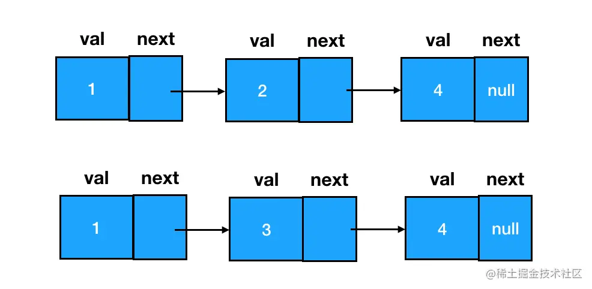
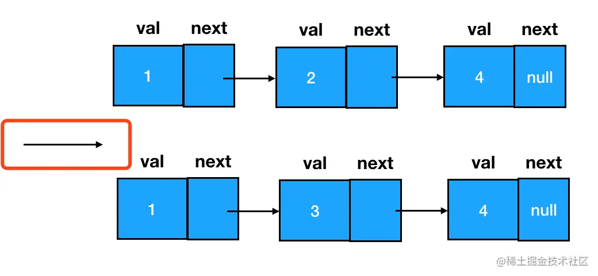
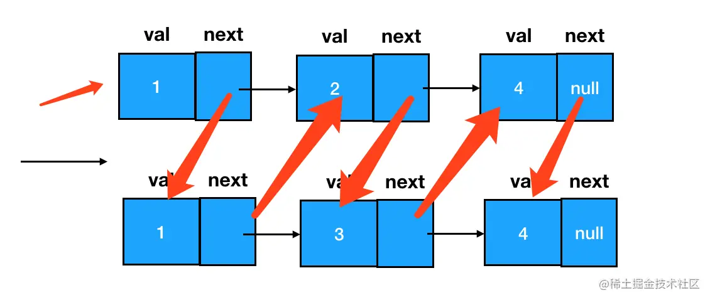
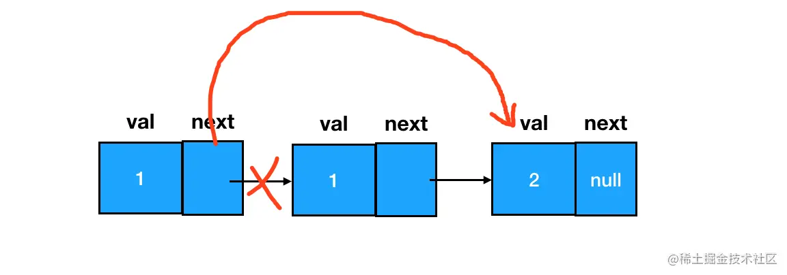

# 算法中链表的应用

链表结构相对数组、字符串来说，稍微有那么一些些复杂，所以针对链表的真题戏份也相对比较多。

前面咱们说过，数组、字符串若想往难了出，那一定是要结合一些超越数据结构本身的东西 —— 比如**排序算法**、**二分思想**、**动态规划**思想等等。因此，这部分对应的难题、综合题，我们需要等知识体系完全构建起来之后，在真题训练环节重新复盘。

但是链表可不一样了。如果说在命题时，数组和字符串的角色往往是 “算法思想的载体”，那么链表本身就可以被认为是 “命题的目的”。单在真题归纳解读环节，我们能讲的技巧、能做的题目已经有很多。结合实际面试中的命题规律，我把这些题目分为以下三类：

- 链表的处理：合并、删除等（删除操作画个记号，重点中的重点！）
- 链表的反转及其衍生题目
- 链表成环问题及其衍生题目
本节我们就以链表的处理为切入点，一步一步走进链表的世界。

## 链表的合并

> 真题描述：将两个有序链表合并为一个新的有序链表并返回。新链表是通过拼接给定的两个链表的所有结点组成的。
>
> 示例： 输入：1->2->4, 1->3->4 输出：1->1->2->3->4->4

### 思路分析

做链表处理类问题，大家要把握住一个中心思想 —— **处理链表的本质，是处理链表结点之间的指针关系**。
这道题也不例外，我们先来看看处理前两个链表的情况：



两个链表如果想要合并为一个链表，我们恰当地补齐双方之间结点 `next` 指针的指向关系，就能达到目的。



现在只需要比对两个结点，选择较小的那个，优先追加到链表中。



同时我们还要考虑 l1 和 l2 两个链表长度不等的情况：若其中一个链表已经完全被串进新链表里了，而另一个链表还有剩余结点，考虑到该链表本身就是有序的，我们可以直接把它整个拼到目标链表的尾部。

### 编码实现

```js
/**
 * @param {ListNode} l1
 * @param {ListNode} l2
 * @return {ListNode}
 */
const mergeTwoLists = function (l1, l2) {
  // 定义头结点，确保链表可以被访问到
  const head = new ListNode()
  // cur 这里就是当前的结点
  let cur = head
  // 开始在 l1 和 l2 间穿梭了
  while (l1 && l2) {
    // 如果 l1 的结点值较小
    if (l1.val <= l2.val) {
      // 先串起 l1 的结点
      cur.next = l1
      // l1 指针向前一步
      l1 = l1.next
    }
    else {
      // l2 较小时，串起 l2 结点
      cur.next = l2
      // l2 向前一步
      l2 = l2.next
    }

    // 串起一个结点后，也会往前一步
    cur = cur.next

  }
  // 处理链表不等长的情况
  cur.next = l1 !== null ? l1 : l2
  // 返回起始结点
  return head.next
}
```

## 链表结点的删除

我们先来看一道基础题目：

```
真题描述：给定一个排序链表，删除所有重复的元素，使得每个元素只出现一次。

示例 1:
输入: 1->1->2
输出: 1->2
示例 2:
输入: 1->1->2->3->3
输出: 1->2->3
```

### 思路分析

链表的删除是一个基础且关键的操作，我们在数据结构部分就已经对该操作的编码实现进行过介绍，这里直接复用大家已经学过的删除能力，将需要删除的目标结点的前驱结点 `next` 指针往后指一格：



判断两个元素是否重复，由于此处是已排序的链表，我们直接判断前后两个元素值是否相等即可。

### 编码实现

```js
/**
 * @param {ListNode} head
 * @return {ListNode}
 */
const deleteDuplicates = function (head) {
  // 设定 cur 指针，初始位置为链表第一个结点
  let cur = head
  // 遍历链表
  while (cur != null && cur.next != null) {
    // 若当前结点和它后面一个结点值相等（重复）
    if (cur.val === cur.next.val) {
      // 删除靠后的那个结点（去重）
      cur.next = cur.next.next
    }
    else {
      // 若不重复，继续遍历
      cur = cur.next
    }
  }
  return head
}
```

## 删除问题的延伸 —— dummy 结点登场

```
真题描述：给定一个排序链表，删除所有含有重复数字的结点，只保留原始链表中 没有重复出现的数字。

示例 1:
输入: 1->2->3->3->4->4->5
输出: 1->2->5
示例 2:
输入: 1->1->1->2->3
输出: 2->3
```

### 思路分析

我们先来分析一下这道题和上道题有什么异同哈：相同的地方比较明显，都是删除重复元素。不同的地方在于，楼上我们删到没有重复元素就行了，可以留个 “独苗”；但现在，题干要求我们只要一个元素发生了重复，就要把它彻底从链表中干掉，一个不留。

这带来了一个什么问题呢？我们回顾一下前面咱们是怎么做删除的：在遍历的过程中判断当前结点和后继结点之间是否存在值相等的情况，若有，直接对后继结点进行删除：


这个过程会非常自然，为什么？因为咱们要删除某一个目标结点时，必须知道它的**前驱结点**。在上图中，我们本来就是站在前驱结点的位置，对其后继结点进行删除，只需要将前驱结点的 `next` 指针往后挪一位就行了。

但是现在，咱们要做的事情变成了把前驱和后继一起删掉。

那么沿用之前的思路，我们就会发现出现问题了。我们无法获取到第一个结点的前驱结点，因此就无法删除掉第一个 `1`。

其实在链表题中，经常会遇到这样的问题：链表的第一个结点，因为没有前驱结点，导致我们面对它无从下手。这时我们就可以用一个 `dummy` 结点来解决这个问题。

所谓 dummy 结点，就是咱们人为制造出来的第一个结点的前驱结点，这样链表中所有的结点都能确保有一个前驱结点，也就都能够用同样的逻辑来处理了。

`dummy` 结点能够帮助我们降低链表处理过程的复杂度，处理链表时，不设 dummy 结点思路可能会打不开；设了 dummy 结点的话，就算不一定用得上，也不会出错。

如此一来，我们只需要定义一个 `dummy` 结点即可。

```js
/**
 * @param {ListNode} head
 * @return {ListNode}
 */
const deleteDuplicates = function (head) {
  // 极端情况：0个或1个结点，则不会重复，直接返回
  if (!head || !head.next)
    return head
  // dummy 登场
  const dummy = new ListNode()
  // dummy 永远指向头结点
  dummy.next = head
  // cur 从 dummy 开始遍历
  let cur = dummy
  // 当 cur 的后面有至少两个结点时
  while (cur.next && cur.next.next) {
    // 对 cur 后面的两个结点进行比较
    if (cur.next.val === cur.next.next.val) {
      // 若值重复，则记下这个值
      const val = cur.next.val
      // 反复地排查后面的元素是否存在多次重复该值的情况
      while (cur.next && cur.next.val === val) {
        // 若有，则删除
        cur.next = cur.next.next
      }
    }
    else {
      // 若不重复，则正常遍历
      cur = cur.next
    }
  }
  // 返回链表的起始结点
  return dummy.next
}
```
