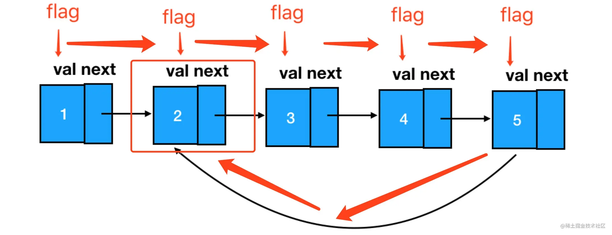

# 环形链表

环形链表是链表中的一类特殊问题，它和链表反转一样，有着相对恒定的解题思路和适当的变体。

如果你对它的特性和解法没有预先的了解和把握，那么前期的推导可能会花去你大量的时间。

反过来看，只要我们能够掌握其核心思路，那么不管它怎么变化，大家都能在瞬间找到解题的 “抓手”、进而给出正确的解答。

## 环形链表基本问题 —— 如何判断链表是否成环？

```
真题描述：给定一个链表，判断链表中是否有环。

示例 1：
输入：[3,2,0,4]（链表结构如下图） 输出：true
解释：链表中存在一个环
```


### 思路解读

一个环形链表的基本修养，是能够让遍历它的游标回到原点：

从 flag 出发，只要我能够再回到 flag 处，那么就意味着，我正在遍历一个环形链表。

我们按照这个思路来做题：

### 编码实现

```js
/**
 * @param {ListNode} head
 * @return {boolean}
 */
// 入参是头结点
const hasCycle = function (head) {
  // 只要结点存在，那么就继续遍历
  while (head) {
    // 如果 flag 已经立过了，那么说明环存在
    if (head.flag) {
      return true
    }
    else {
      // 如果 flag 没立过，就立一个 flag 再往下走
      head.flag = true
      head = head.next
    }
  }
  return false
}
```

## 环形链表衍生问题 —— 定位环的起点

```
真题描述：给定一个链表，返回链表开始入环的第一个结点。 如果链表无环，则返回 null。
示例 1：
输入：head = [3,2,0,-4]（如下图） 输出：tail connects to node index 1 解释：链表中有一个环，其尾部连接到第二个结点。
```


```
示例 2：
输入：head = [1,2]（如下图）
输出：tail connects to node index 0
解释：链表中有一个环，其尾部连接到第一个结点。 
```


```
示例 3：
输入：head = [1]（如下图）
输出：no cycle
解释：链表中没有环。
```


### 思路解读

这道题在上道题的基础上，仅仅增加了一个 “返回链表的成环起点”，其难度定义就从 `easy` 上升到了 `medium`。

不过对于掌握了关键解题思路的各位来说，这道题仍然是 easy—— 因为如果一个结点是环形链表成环的起点，那么它一定是第一个被发现 flag 标志已存在的结点：



这一点不难理解，我们试想如果从头开始遍历一个链表，假如途中进入了一个环，那么首先被打上 flag 标签的其实就是环的起点。

待我们遍历完这个环时，即便环上所有的结点都已经被立了 flag，但起点处的 flag 一定最先被我们定位到。

因此，我们只需要在第一次发现 flag 已存在时，将对应的结点返回即可：

### 编码实现

```js
/**
 * @param {ListNode} head
 * @return {ListNode}
 */
const detectCycle = function (head) {
  while (head) {
    if (head.flag) {
      return head
    }
    else {
      head.flag = true
      head = head.next
    }
  }
  return null
}
```

### 快慢指针的思路

这道题还有一个公认的比较经典的思路，就是用快慢指针来做：

定义慢指针 `slow`，快指针 `fast`。两者齐头并进， slow 一次走一步、fast 一次 走两步。

这样如果它们是在一个有环的链表里移动，一定有相遇的时刻。这个原理证明起来也比较简单：我们假设移动的次数为 `t`，slow 移动的路程就是 t，fast 移动的路程为 `2t`，假如环的长度为 `s`，那么当下面这个条件：

```
2t - t = s
```

也就是：

```
t = s
```

满足时，`slow` 和 `fast` 就一定会相遇。反之，如果两者没有相遇，同时 fast 遍历到了链表的末尾，发现 next 指针指向 null，则链表中不存在环。

## 弦外之音

在这一节，大家会发现一个非常有趣的现象 —— 做环形链表的系列题目，难点其实在于你怎么去想明白这个成环的过程、怎么把握成环后的特性。

真正编码实现的时候，寥寥数行就可以搞定。这其实也是我想要向大家传达的一个重要的解题习惯 —— 做算法题时，不要急于下手写代码，而应该先静下心来，稳住神、一步一步捋清楚你自己的思路。

之所以要把这点单独拎出来讲，是因为我知道很多同学平时写业务代码比较多。

前端业务代码是什么特征？干就完了，对吧？反正就算代码有问题，也可以通过直观的视觉反馈及时发现、及时修复。在肉眼可见的反馈的指导下，你基本不会出什么方向性的问题。

做算法题就大不一样了，真正提交运行之前，除了你自己的逻辑判断之外、没有任何直观的线索能够帮你明确问题的所在。也就是说，如果你一开始压根没想清楚、脑子里本来就是一团乱麻，那么直接开干后往往是越写越乱、最后代码的修复成本也会变得非常高。

盲写代码、乱写代码，不仅容易扰乱自己的思路，也会给面试官留下 “这个人怎么这么冒失” 一类的负面印象。

所以大家一定要尽量规避这种行为，如果实在对自己的思路感到不确定、不自信，这时候可以问对方要张纸、先线下梳理一下。真正面试的时候，我们对于自己敲在屏幕上的每一行代码，都应该抱有敬畏之心。
