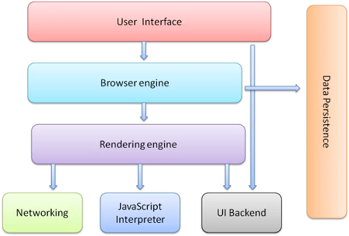
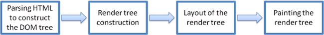
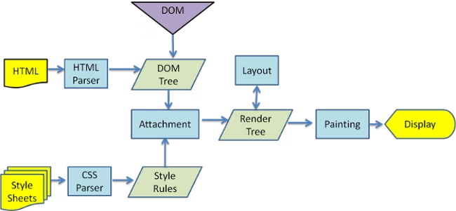
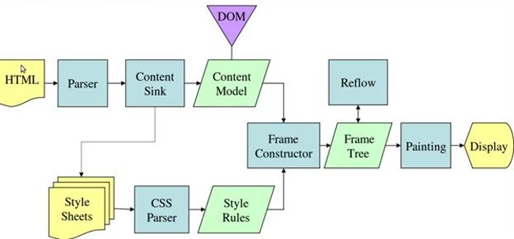
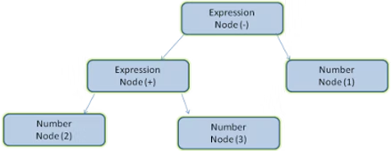
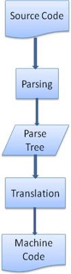

# 揭秘现代浏览器的渲染引擎（一）

声明 1：

> 本文翻译自  [How browsers work](https://web.dev/howbrowserswork/)
> 个人理解翻译可能会出现偏差，有兴趣请翻阅原文

声明 2：

> 原文发表日期距今日已有十年，虽然内容可能已经过时，但是作为系统讲述浏览器渲染引擎内部原理的文章，我还是想要翻译一遍，供大家参考。

## 前言

这本关于 `Webkit` 和 `Gecko` 内部操作的全面入门书是以色列开发者 `Tali Garsiel` 大量研究的成果，在几年的时间里，她回顾了所有已发表的关于浏览器内部结构的资料，并花费大量时间阅读 Web 浏览器的源码，她写道：

> 在 IE 占据 90% 统治地位的那些年里，我们除了把浏览器当作 ”黑盒子“之外，没什么可以做的。但是现在，随着开源浏览器拥有[超过一半的使用份额](https://techcrunch.com/2011/08/01/open-web-browsers/#)，这是一个好时机看看一个 Web 浏览器的表面之下有什么。噢好吧，那里面有数百万的 C++ 代码......

Tail 在她的[网站](http://taligarsiel.com/)上发表了她的研究，但我们知道它值得拥有更多的读者，所以我们整理了这篇文章，并在这里重新发表。

> “作为一个 Web 开发者，学习浏览器操作的原理，可以帮助你更好的决策，并了解开发最佳实践的背后真正的原因。虽然这篇文章会很长，但是我建议你花费一些时间好好阅读，我保证你会很庆幸这么做了。”
> 
> Paul Irish, Chrome Developer Relations


## 简介

Web 浏览器是使用最广泛的软件，在这本初级读物中，我将会解释它们是如何在幕后工作的。

## 我们将会讨论的浏览器

目前的主流浏览器有 5 个：`Chrome`、`IE`<sup><a href="#c1">1</a></sup>、`Firefox`、`Safari` 和 `Opera`。在手机上，主要的浏览器有 `Android Browser`、`iPhone`<sup><a href="#c2">2</a></sup>、`Opera Mini` 和 `Opera Mobile`、`UC Browser`、诺基亚 S40/S60 浏览器和 `Chromall`，除了 `Opera` 之外，其他的浏览器都基于 `Webkit` 作为渲染引擎。我们将会给出来自开源浏览器 Firefox 和 Chrome 以及 Safari（部分开源）的例子。

## 浏览器的主要功能

浏览器的主要功能是通过服务器请求并在浏览器窗口中显示资源。资源通常是 HTML 文档，也可能是 PDF、图片或其他东西。资源的位置由 URI(Uniform Resource Identifier, 统一资源标识符)指定。

浏览器解析和显示 HTML 文件的方式在 HTML 和 CSS 规范中制定，这些规范由 W3C(World Wide Web Consortium, 万维网联盟)组织维护，该组织是 Web 的标准组织。多年来，浏览器只遵循部分规范，并开发了自己的拓展，这给网站作者带来了严重的兼容问题。今天，大多数的浏览器都或多或少符合规范。

浏览器的用户界面由很多共通之处，其中常见的用户界面元素有：

- 用于插入 URI 的地址栏
- 前进后退按钮
- 书签选项
- 刷新和停止按钮，以便刷新和停止加载当前文档
- 主页按钮，用于快速到达主页

奇怪的是，浏览器的用户界面没有任何形式的规范，它只是来自多年来各个浏览器互相模仿的良好实践。HTML 5 规范没有定义浏览器必备的 UI 元素，但列出了一些常见的元素，例如地址栏、状态栏和工具栏。

## 浏览器的高级结构

浏览器的主要组件包括：

- **用户界面**：包括地址栏，前进后退按钮等。
- **浏览器引擎**：封装 UI 和渲染引擎之间的操作。
- **渲染引擎**：负责渲染请求的内容，例如请求的内容是 HTML，那么就负责解析 HTML 和 CSS，并在屏幕上显示解析好的内容。
- **网络**：用于 HTTP 请求之类的网络调用
- **UI 后端**：用于绘制组合框和窗口等基本的小组件
- **JS 解释器**：解析和执行 JS
- **数据存储**：这是一个持久层，浏览器可以在本地储存数据。



值得注意的是，像 Chrome 这样的浏览器运行多个渲染引擎实例：每个标签一个，每个标签都运行在独立的进程中。

## 渲染引擎

渲染引擎的职责很好......渲染：即在浏览器屏幕上显示请求的内容。

默认情况下，渲染引擎可以显示 HTML 和 XML 文档以及图像，它也可以通过插件或者扩展显示其他的内容，例如 PDF 等。但是在本文中，重点关注 HTML 和 CSS。

不同的浏览器使用不同的渲染引擎，IE 使用 `Trident`，Firefox 使用 `Gecko`、Safari 使用 `Webkit`、Chrome 和 Opera （从 15 版本开始）使用 `Blink`，这是 Webkit 的一个分支。

Webkit 是一个开源的渲染引擎，最初是 Linux 平台的引擎，后来被苹果修改以支持 Mac 和 Windows，更多细节可以参考 [webkit.org](https://webkit.org/)


## 主流程

渲染引擎将开始从网络层获取请求文档的内容，这通常是在 8kb 的块中完成的。之后就是引擎的主要流程：



渲染引擎将开始解析 HTML 文档，并将元素转为一个叫做 `Content Tree`（内容树）中的 DOM 节点。之后引擎开始解析样式数据，样式信息以及 HTML 中的可视化指令将用于创建另一棵树：`Render Tree`（渲染树）

渲染树包含带有颜色和尺寸等视觉属性的矩形，矩形按照正确的顺序显示在屏幕上。

在构建渲染树后，会经历一个“布局”的过程，每个节点提供它应该出现在屏幕上的确切坐标。下一步是绘制：遍历渲染树，每个节点将使用 UI 后端层绘制。

重要的是要明白这是一个渐进的过程。为了用户能有更好的体验，渲染引擎将尽快在屏幕上显示内容。在开始构建和布局渲染树时，不会等解析完所有的 HTML 节点。已获取的内容部分将被解析和显示，同时该过程还会等待网络获取的剩余内容。

### 主要流程示例



<center>图：Webkit 主流程</center>



<center>图：Mozilla 的 Gecko 主流程</center>

从两种图可以看出，尽管 Webkit 和 Gecko 的术语略有不同，但是主流程上基本还是相同的。

Gecko 称视觉格式化元素的树为`Frame Tree`（框架树）。每个元素都是一个框架，Webkit 使用的术语是 `Render Tree`（渲染树），它由 `Render Objects`（渲染对象）组成。

Webkit 使用术语 `Layout`（布局）来放置元素，而 Gecko 使用术语 `Reflow`（重排）。

`Attachment`（附加信息）是 Webkit 的术语，用于连接 DOM 节点和可视化信息以创建渲染树。Gecko 在 HTML 和 DOM 树之间有一个额外的层，它被称为 `Content Slink`（内容接收器），是制作 DOM 元素的工厂。接下来，我们将会讨论每个部分：

### 解析概括

由于解析(Parse)是渲染引擎中相当重要的过程，所以这里将更深入的介绍它。我们先简单了解一下什么是解析：

解析文档意味着将内容翻译为代码可以使用的结构，解析的结果通常是描述文档的节点树，这会被成为解析树(Parse Tree)或者语法树(Syntax Tree)。

举个例子，解析表达式 `2 + 3 - 1` 可以返回这样的一个树：


<center>数学表达式树</center>

### 语法

解析基于文档遵守的语法规则：那就是文档所使用的语言格式。每种语言规范都必须具有由**词汇表**和**语法规则**组成的确定性语法。它被成为上下文无关语法。

### 语法分析器和词法分析器的组合

解析可以分为两个子过程：词法分析和语法分析。

词法分析就是将输入的内容分解为标记(Token)的过程。Token 是语言词汇表：即有效构建块的集合。在人类的语言中，它是所有出现在词典中的单词。

语法分析是语言语法规则的应用。

浏览器的解析器通常将工作分为两个部分：词法分析器（`Lexer`，有时又会被成为 `tokenzier`）负责将输入分解为有效的 Token。解析器(`Parser`)负责根据语言语法规则分析文档结构，从而构建解析树。

词法分析器知道如何去除不相干的字符，例如空格和换行符。


<center>图：从原文档到解析树</center>

解析的过程是迭代的。解析器通常会像词法分析器请求一个新的 Token，并尝试将该 Token 与语法规则匹配。如果存在一个规则被匹配，与该 Token 对应的节点将会被添加到解析树中，解析器将会请求下一个 Token。

如果没有匹配的规则，解析器将在内部储存当前 Token，并继续请求 Token，直到找到匹配所有内部储存的 Token 的规则。如果最后还是没有匹配的规则，那么解析器将会抛出一个异常，这意味着文档无效并包含语法错误。

### 翻译

在多数情况下，解析树不是最终的产物。解析通常用于翻译：将输入文档转为另一种格式。代码编译就是一个例子，将源代码编译为机器代码的编译器首先会将其解析为一个解析树，然后将该树翻译为一个机器代码文档。


<center>编译流程</center>
### 解析示例

在上文的图中，我们从数学表达式构建了一个解析树。让我们尝试定义一种简单的数学语言，并查看解析过程。

> 关键词：
> 我们的语言可以包括整数、加号和减号

语法：

1. 语言语法构建块是表达式、术语和操作
2. 我们的语言可以包含任意数量的表达式
3. 表达式被定义为**术语**后跟**操作**后跟另一个**术语**
4. 操作符是加号标记或减号标记
5. 术语是一个整数 Token 或一个表达式

让我们分析输入 `2 + 3 - 1`

与规则匹配的第一个子字符串是 `2`，根据规则 5，它是一个术语。第二个匹配是 `2 + 3`，这个匹配了规则 3，一个术语跟着一个操作符后跟着另一个术语。

下一个匹配只会在输入的末尾命中。`2 + 3 - 1` 是一个表达式，因为我们已经知道了 `2 + 3` 是一个术语，所以我们有一个数据跟着一个操作，再跟另一个术语。

如果出现了`2 + +`， 不匹配任何规则，因此是无效输入。

### 词汇和语法的正式定义

词汇表通常由[正则表达式](https://www.regular-expressions.info/)表示：

例如，我们的语言将被定义为：

```
INTEGER: 0|[1-9][0-9]*  
PLUS: +  
MINUS: -
```

如你所见，整数由正则表达式定义。

语法通常被定义为 [BNF](https://en.wikipedia.org/wiki/Backus%E2%80%93Naur_form) 格式，我们的语言可以定义为：

```
expression ::= term operation term
operation ::= PLUS | MINUS
term ::= INTERGER | operation
```

我们说过，如果一个语言的语法是上下文无关的语法，那么它就可以被常规解析器解析。上下文无关语法的直观定义是一种可以完全用 BNF 表示的语法。正式的定义见[这里](https://en.wikipedia.org/wiki/Context-free_grammar)

### 解析器类型

有两种类型的解析器：**自顶向下解析器**和**自底向上解析器**。一个直观的解释是：**自顶向下**的解析器检查语法的高级结构，并尝试找到规则匹配。**自底向上**的解析器则从输入开始，逐步将其转换为语法规则，从低级规则开始，直到满足高级规则。

让我们来看看这两个种类的解析器如何解析我们的示例：

**自顶向下**解析器将从更高级别的规则开始：它将 `2 + 3` 的标识识别为一个表达式。然后它将 `2 + 3 - 1` 的标识识别为一个表达式（识别表达式的过程不断发展，与其他规则相匹配，但起始点是最高级别的规则）

**自底向下**解析器将扫描输入，直到匹配规则。然后，它将用规则替换匹配的输入。这将一直持续到输入结束。部分匹配的表达式会放在解析器的栈中。

|  栈  |  输入|
|  ---- |  ---- |
|      |  2 + 3 - 1|
| term | + 3 - 1|
| term operation | 3 - 1|
| expression | - 1 |
| expression operation | 1 |
| expression | - |

这种类型的**自底向上**解析器被称为`shift-reduce`解析器。因为输入会一直**右移**。（想象一下，一个指针首先指向开头，然后向右移动，并逐渐减少语法规则）。

### 自动生成解析器

有一些工具可以生成解析器。你向他们提供你的语言的语法，即其词汇表和语法规则。它们就可以生成一个可以工作的解析器。创造解析器需要对解析有深入的理解，而且手写优化过的解析器非常不容易，因此生成解析器十分有用。

Webkit 使用两个众所周知的解析器生成器：`Flex` 用于创建词法解析器(lexer)，`Bison` 用于创建解析器(parser)，你可能会通过 `Lex` 和 `Yacc` 的名字碰到他们。**Flex**的输入是一个包含标识(token)的正则表达式定义的文件。**Bison**的输入是 BNF 格式的语言语法规则。

## 译注

- <span name="c1" id="c1">1</span>：IE 浏览器已于 2022-06-16 退役，这里的 IE 应为 `Edge` 更为合适。
- <span name="c2" id="c2">2</span>：在 ios 平台中，仍是 safari