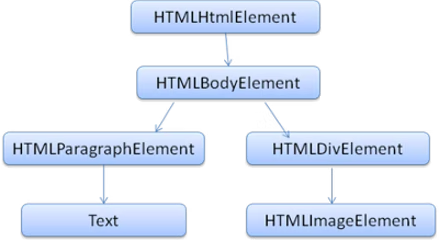
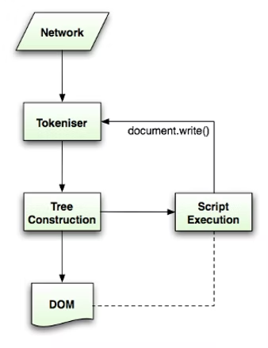
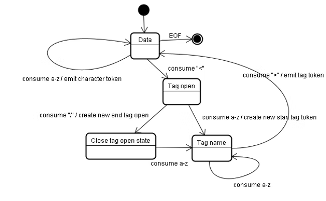
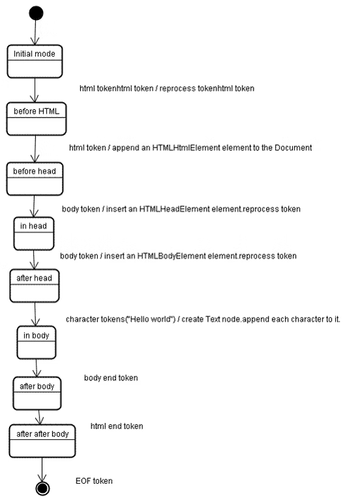
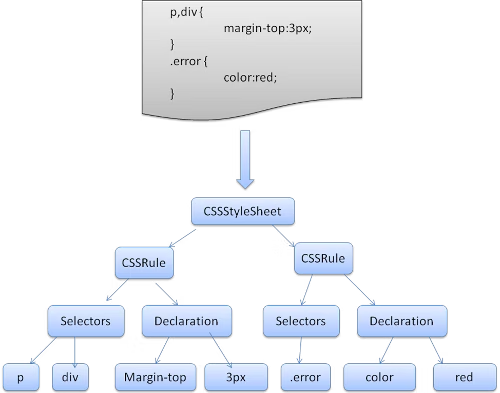

# 揭秘现代浏览器的渲染引擎（二）

声明 1：

> 本文翻译自  [How browsers work](https://web.dev/howbrowserswork/)
> 个人理解翻译可能会出现偏差，有兴趣请翻阅原文

声明 2：

> 原文发表日期距今日已有十年，虽然内容可能已经过时，但是作为系统讲述浏览器渲染引擎内部原理的文章，我还是想要翻译一遍，供大家参考。

## HTML 解析器

HTML 解析器的工作就是将 HTML 文件解析为解析树(Parse Tree)。

### HTML 语法定义

HTML 的词汇表和语法在 W3C 组织创建的规范中定义

### 不是上下文无关的语法

正如我们在解析介绍中说的那样，可以使用 BNF 等格式来正式定义语法。

遗憾的是，所有传统的解析器主题都不适用于 HTML（但是可以被用于 CSS 和 JS 解析）。HTML 不能够很容易地由上下文无关语法所定义。

有一种定义 HTML-DTD (Document Type Definition, 文档类型定义) 的正式格式，但它不是上下文无关语法。

乍一看，这其实很奇怪。HTML 和 XML 非常接近，有很多可以用于解析 XML 的解析器，HTML 还有一个 XML 变体 - `XHTML`。那么有什么大的区别呢？

不同之处在于，HTML 语法更加**宽容**：它允许你省略某些 Token（然后隐式添加），或者有时省略开头或者结尾的 Token 等等。总的来说，它是一种“软”语法，而不是 XML 的僵硬且严苛的语法。

这个微不足道的细节，却让世界大有不同。一方面，这也是 HTML 如此流行的主要原因：它能原谅你的错误，让 Web 开发者的生活更加轻松。另一方面，它使得写一个正式的语法变得困难。而由于它的语法不是上下文无关的，传统的解析器无法很容易的解析 HTML。HTML 不能被 XML 解析器所解析。

### HTML DTD

HTML 定义采用 DTD 格式。这种格式用于定义 [SGML](https://en.wikipedia.org/wiki/Standard_Generalized_Markup_Language) （标准通用标记语言）家族的语言。该格式包含所有允许的元素、其属性和层次的定义。正如前面说到的， HTML DTD 并不形成上下文无关的语法。

DTD 有一些变体。严格模式完全符合浏览器规范，但其他模式包含浏览器过去使用的标记的支持，其目的是为了向后兼容。目前严格的 DTD 是 [这里](http://www.w3.org/TR/html4/strict.dtd)

### DOM

输出树（或者解析树 Parse Tree）是由 DOM 元素和属性节点组成的树。DOM 是文档对象模型的缩写。它是 HTML 文档的对象表示和 HTML 元素对外界（如 JavaScript）的接口。

树的根节点是 [`Document`](https://www.w3.org/TR/1998/REC-DOM-Level-1-19981001/level-one-core.html#i-Document) 对象

DOM 与 Token 几乎是一对一的关系，例如：

```html
<html>  
	<body>  
		<p>  
		Hello World  
		</p>  
		<div>  </div>  
	</body>  
</html>
```

这个 Token 将会转换为如下的 DOM 树：


图：示例代码的 DOM 树

与 HTML 一样，DOM 结构也是由 W3C 组织指定的。[看这里](http://www.w3.org/DOM/DOMTR)。它是一个操作文档的通用规范。特定的模块描述 HTML 特定的元素。HTML 的定义可以在[这里](https://www.w3.org/TR/2003/REC-DOM-Level-2-HTML-20030109/idl-definitions.html)找到。

当我说树包含 DOM 节点时，我的意思其实是树是由实现一个 DOM 接口的元素构成的。浏览器使用具体的实现，这些实现具有浏览器内部使用的其他属性。

#### 解析算法

正如我们在前面几节中看到的那样，HTML 不能使用常规的自顶向下或者自底向上的解析器进行解析。

原因如下：

1. 语言的宽容本质
2. 事实上，浏览器具有传统的容错能力来支持众所周知无效的 HTML 的情况。
3. 解析的过程是能够重入的。对于其他语言，源代码在解析期间是不会改变的，但在 HTML 中，动态代码（如包含 `document.write()` 调用）可以添加额外的标记，因此解析过程中其实是修改了输入。

由于无法使用常规的解析技术，浏览器创建了用于解析 HTML 的自定义解析器。

[HTML 5 规范](http://www.whatwg.org/specs/web-apps/current-work/multipage/parsing.html)对解析算法进行了详细的描述，该算法分为两个阶段：**标记化**和**树构造**。

`Tokenization` 用于词法分析，它将输入解析为 Token。HTML 的 Token 包括开始标签、结束标签、属性名称和属性值。

分词器(tokenizer)识别 Token，将其交给树构造函数，并使用下一个字符识别下一个 Token，以此类推直到输入消费完毕。


图：HTML 解析流，源于 HTML 5 规范

### 标记化算法

该算法的输出是一个 HTML Token。该算法表示为一个状态机，每个状态使用输入流的一个或多个字符，并根据这些字符更新下一个状态。决策受当前标记化状态和树构造状态的影响。这意味着同一个被消耗的字符对于正确的下一个状态会产生不同的结果，这取决于当前状态。

这个算法太复杂了，无法完全描述，所以我们看一个例子，它有助于我们理解背后的原理：

示例：对下列的 HTML 进行标记化

```html
<html>  
	<body>  
		Hello world  
	</body>  
</html>
```

初始状态是**Data state**。遇到 `<` 字符时，状态更改为 **Tag open state**。消费一个 `a-z` 字符会导致创建 "Start Tag Token"，状态将更改为 **Tag name state**。保持这种状态，直到 `>` 被消费。每个字符都附加到新的 Token 名称，在我们的示例中，创建的 Token 是一个 html Token。

当达到 `<` 标记时，发出当前的 Token 并将状态恢复为 **Data state**。`<body>` 将通过相同的流程进行处理。到目前位置，我们已经发出了 html 和 body Token。现在回到了 **Data state**。消费 `Hello world` 的 `H` 将导致创建和发出字符 Token，一直持续到 `</body>`。我们将会为 `Hello world` 的每一个字符发出一个字符 Token。

现在我们回到了 **Tag open state**。消费下一个输入 `/` 将导致创建一个结束 Token 并移动到 **Tag name state** 状态。再次保持这个状态，直到到达 `>`。然后发出一个 `tag` Token，并返回到 **Data state** 状态。`</html>` 输入将像前面的情况一样处理。


图：对示例输入进行标记化
#### 树的构造算法

创建解析器时，将创建 Document 对象。在树的构建阶段，DOM 树的根节点 Document 将会被修改，元素将会添加其中。标记器(tokenzier)发送的每个节点都由树构造函数处理。对于每个 Token，规范定义了与其相关的 DOM 元素，并将为此 Token 创建对应的 DOM 元素。

元素将会被添加到 DOM 树以及打开元素的栈中。这个栈用于纠正嵌套不匹配和未关闭的 tag。这个算法也被描述为一个状态机，这些状态称之为 “插入模式”。

让我们来看看示例输入的树构造过程：

```html
<html>  
	<body>  
		Hello world  
	</body>  
</html>
```

树构造阶段的输入来自于标记化阶段的输出，也就是一系列的 Token。起始模式是**initial mode**，接收 HTML Token 将会移动到 **before html mode**。并在该模式下重新处理 HTML Token。这将会导致创建 `HTMLHtmlElement` 元素，该元素将会追加到根节点 `Document` 对象中。

状态将会改变为**before head**，然后接收 `body` Token。一个 `HTMLHeadElement` 将会被隐式创建，尽管我们没有指定 `<head>`。这个元素将会被添加到 `Document` 对象中。

现在状态将会被改变为 **in head** 模式，紧接着被改变为 **after head**。`body` Token 将会重新处理，一个 `HTMLBodyELement` 元素会被创建并插入，状态变为 **in body**。现在接收 "Hello world" 字符串的字符 Token，第一个字符将会创建并插入一个 Text 节点。其他字符将附加到这个节点中。

接收 `body` 结束的标记，状态将会改变为 **after body**。现在开始接收 `html` 结束的Token，然后状态转为 **after after body**。最后，接收文件结束的 Token 将结束解析工作。


图：示例 HTML 的树结构

### 解析结束时的操作

在这个阶段，浏览器将会把文档标记为交互式的，并开始解析处于 `deferred` 模式的 scripts：就是那些应该在文档被解析后执行的脚本。然后，文档的状态将会被设置为 `complete`，`load` 事件将会被触发。

你可以在 [HTML 5 规范](http://www.w3.org/TR/html5/syntax.html#html-parser)中查看标记化和树构造的完整算法。 


### 浏览器的容错能力

你永远不会在 HTML 中得到一个 `Invalid Syntax`（语法错误）的异常，浏览器可以修复任何无效的内容，然后继续。

以这个 HTML 为例子：

```html
<html>  
	<mytag>  
	</mytag>  
		<div>  
			<p>  
		</div>  
		Really lousy HTML  
		</p>  
</html>
```

我肯定是违反了大约一百万条的规则( `mytag` 不是一个标准的标签，错误的嵌套了 p 元素和 div 元素等等)。但浏览器仍可以正确的显示，而且没有任何抱怨。所以很多解析器代码都在修复 HTML 开发者的错误。

在浏览器中，错误处理是相当一致的，但令人惊讶的是，它还没有成为 HTML 规范中的一部分。就像书签和前进、后退按钮一样，这都是浏览器多年发展来的东西。浏览器是为了与和其他浏览器对于错误语法的修复行为一致。

HTML 5 规范确实定义了其中一些要求(WebKit 在 HTML 解析器类开头的注释中很好地总结了这一点)。

解析器将标记化的输入解析到文档中，构建文档树。如果文档的格式是合规的，那么解析起来其实很容易。

不幸的是，我们必须要处理需要格式不合规的 HTML 文档，因此解析器必须能够容忍错误。

我们必须要考虑以下错误条件：

- 被添加的元素被某个外部标签明确禁止，在这种情况下，我们应该关闭此元素的所有标签，直到禁止该元素的标签为止。然后再添加它。
- 我们不允许直接添加元素，这可能是编写文档的人忘记了中间的某个标签（或者那个标签是可选的）。下面的标签可能是一种情况：HTML HEAD BODY TBODY TR TD LI（我是不是忘记了什么？<sup><a href="#a1">1</a></sup>)
- 我们想要在一个内联元素中添加一个块元素，关闭所有的内联元素，直到下一个更高级别的块级元素。
- 如果这没有帮助，就关闭元素，直到我们被允许添加元素或者忽略这个标签。

让我们看一些 Webkit 的容错示例：

#### `</br >` 而不是 `<br>`

有一些网站会使用 `</br>` 来代替 `<br>`。为了和 IE 以及 Firefox 兼容，Webkit 必须要将这个语法视为 `<br>`。

具体代码：

```cpp
if (t->isCloseTag(brTag) && m_document->inCompatMode()) {
     reportError(MalformedBRError);
     t->beginTag = true;
}
```

注意，错误处理是内部的，并不会呈现给用户。

#### 一个流浪的表格

一个流浪的表格是在一个表格中嵌套了另一个表格，但不是位于表格单元中的表格。

举个例子：

```html
<table>
  <table>
    <tr><td>inner table</td></tr>
  </table>
  <tr><td>outer table</td></tr>
</table>
```

Webkit 会将其结构改为两张兄弟表：

```html
<table>
  <tr><td>outer table</td></tr>
</table>
<table>
  <tr><td>inner table</td></tr>
</table>
```

具体代码：

```cpp
if (m_inStrayTableContent && localName == tableTag)
        popBlock(tableTag);
```


Webkit 会为当前当前元素内容创建一个栈，它会将内部表从外部表中的栈中弹出，这两个表格就是兄弟元素了。

#### 嵌套的表单元素

如果用户将一个表单放在另一张表单中，则会忽略第二张表单。

具体代码：

```cpp
if (!m_currentFormElement) {
        m_currentFormElement = new HTMLFormElement(formTag, m_document);
}
```


#### 标签层级结构太深

这句话不言自明。

> 只允许最多 20 个同类型的嵌套标记，再多就会忽略掉了。

具体代码：

```cpp
bool HTMLParser::allowNestedRedundantTag(const AtomicString& tagName)
{

unsigned i = 0;
for (HTMLStackElem* curr = m_blockStack;
         i < cMaxRedundantTagDepth && curr && curr->tagName == tagName;
     curr = curr->next, i++) { }
return i != cMaxRedundantTagDepth;
}
```

#### 放错了 HTML 或者 body 结束标签

又是一个不言自明的主题

> 允许支离破碎的 HTML，我们从不关闭 body 标签，因为一些愚蠢的网页在文档实际结束前就关闭了。我们依赖于 `end()` 来关闭


具体代码：

```cpp
if (t->tagName == htmlTag || t->tagName == bodyTag )
        return;
```

因此 Web 开发者要小心——除非你想在 Webkit 错误容忍的例子中出现。

请编写格式良好的 HTML。

## CSS 解析

还记得上文中的解析概念吗？与 HTML 不同的是，CSS 其实是一种上下文无关语法。可以使用上文中描述的解析器类型解析。实际上，[CSS 规范](https://www.w3.org/TR/CSS/#css)定义了 CSS 的词法和语法。

让我们看一些例子：

词法（词汇表）由每个标记(token)的正则表达式定义：

```
comment   \/\*[^*]*\*+([^/*][^*]*\*+)*\/
num       [0-9]+|[0-9]*"."[0-9]+
nonascii  [\200-\377]
nmstart   [_a-z]|{nonascii}|{escape}
nmchar    [_a-z0-9-]|{nonascii}|{escape}
name      {nmchar}+
ident     {nmstart}{nmchar}*
```


`ident` 是 `identifier` 的缩写，就像类名一样。name 是元素的 id，由 `#` 引用。

语法由 BNF 描述：

```
ruleset
  : selector [ ',' S* selector ]*
    '{' S* declaration [ ';' S* declaration ]* '}' S*
  ;
selector
  : simple_selector [ combinator selector | S+ [ combinator? selector ]? ]?
  ;
simple_selector
  : element_name [ HASH | class | attrib | pseudo ]*
  | [ HASH | class | attrib | pseudo ]+
  ;
class
  : '.' IDENT
  ;
element_name
  : IDENT | '*'
  ;
attrib
  : '[' S* IDENT S* [ [ '=' | INCLUDES | DASHMATCH ] S*
    [ IDENT | STRING ] S* ] ']'
  ;
pseudo
  : ':' [ IDENT | FUNCTION S* [IDENT S*] ')' ]
  ;
```


#### 说明

一个规则集是这样的结构：

```css
div.error, a.error {
  color:red;
  font-weight:bold;
}
```


`div.error` 和 `a.error` 都是选择器。大括号的部分，包含这个规则集所应用的规则。这个结构的定义如下：

```
ruleset
  : selector [ ',' S* selector ]*
    '{' S* declaration [ ';' S* declaration ]* '}' S*
  ;
```

这意味着规则集是一个选择器，或者可以选择由逗号或者空格分隔的选择器数目(S 表示空格)。规则集包含大括号，其中包含一个声明或可选的由分号分隔的多个声明。“声明”和“选择器”将在以下 BNF 定义中定义。

### Webkit CSS 解析器

Webkit 使用 Flex 和 Bison 解析器生成器从 CSS 语法文件自动创建解析器。回想一下解析器的介绍，Bison 创建了一个自底向上的 `shift-reduce` 的解析器。Firefox 使用手工编写的自顶向下的解析器。在这两种情况下，每个 CSS 文件都被解析为 `StyleSheet` 对象，每个对象都包含 CSS 规则。CSS 规则对象包含选择器和声明对象以及与 CSS 语法对应的其他对象。



## 处理 Script 和 StyleSheet 的顺序

### Script

网络的模型是同步的，当解析器达到 `<script>` 标签时，作者希望立即解析和执行脚本。在执行脚本之前，文档的解析将会被暂停。如果脚本是外部的，那么必须首先从网络中获取资源（这也是同步完成的），并且在获取资源之前，解析将暂停。这是多年来的模型，也在 HTML 4 和 5 的规范中指定。作者可以添加一个 `defer` 属性在 `<script>` 标签中，在这种情况下，不会停止文档的解析，而是在文档解析后才会执行。

HTML 5 添加了一个选项，将脚本指定为异步的，这样它会被另一个线程解析和执行。

### 推测性解析

Webkit 和 Firefox 都进行了这种优化。在执行脚本时，另一个线程解析文档的其余部分，找出需要从网络加载哪些资源并加载它们。通过这种方式，可以在并行连接上加载资源，从而提高整体速度。注意：推测性解析只解析外部资源（如外部脚本、样式表和图像）的引用，它不修改 DOM 树（这是留给主解析器的）。

### StyleSheet

另一方面，样式表有不同的模型。从概念上看，样式表不修改 DOM 树，因此没有理由等待它们并停止文档解析。但是，在文档解析阶段会存在一个问题，如果脚本需要样式信息，但是此时样式还没有进行加载和解析，那么脚本获取到的信息是错误的，这显然会导致很多问题。这似乎是一个边缘情况，但却相当普遍。

Webkit 只有在脚本试图访问某些可能受到未加载的样式表影响的样式属性时才会阻止脚本。

## 译注

<span name="a1" id="a1">1</span>：忘记了 TABLE