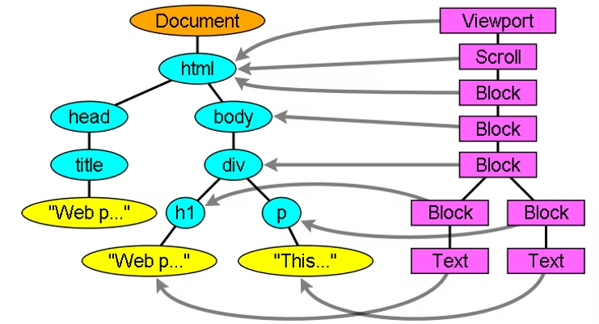
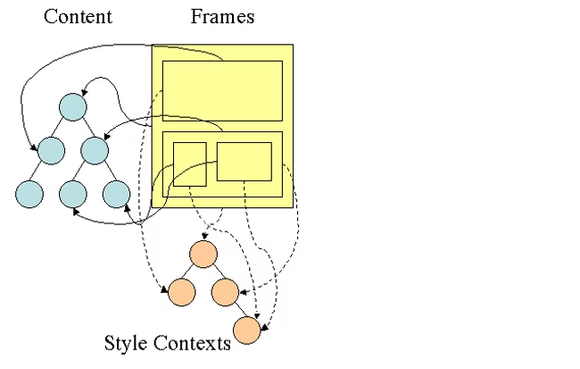
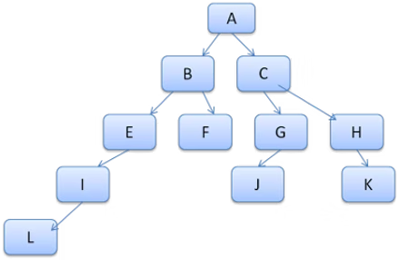
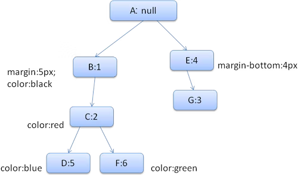
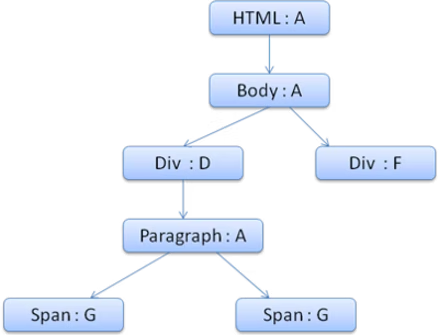

# 揭秘现代浏览器的渲染引擎（三）

声明 1：

> 本文翻译自  [How browsers work](https://web.dev/howbrowserswork/)
> 个人理解翻译可能会出现偏差，有兴趣请翻阅原文

声明 2：

> 原文发表日期距今日已有十年，虽然内容可能已经过时，但是作为系统讲述浏览器渲染引擎内部原理的文章，我还是想要翻译一遍，供大家参考。

## 渲染树结构体<sup><a href="#a1">1</a></sup>

当构造 DOM 树时，浏览器将会构造另一棵树，渲染树。此树的节点是按照显示顺序排列的可视元素。它是文档的可视化表示，此树的目的就是使内容能够按照正确的顺序绘制。

Firefox 称渲染树中的元素为**帧**(Frame)，Webkit 则使用**渲染器**(Renderer)或**渲染对象**(Render Object)这一术语。

渲染器知道如何布局和绘制本身及其子元素。

Webkit 的 `RenderObject` （渲染器的基类）有如下的定义：

```cpp
class RenderObject{
  virtual void layout();
  virtual void paint(PaintInfo);
  virtual void rect repaintRect();
  Node* node;  // DOM 节点
  RenderStyle* style;  // 计算样式
  RenderLayer* containgLayer; // z-index 图层
}
```

每个渲染器表示一个矩形区域，通常对应于一个节点的 CSS 盒子，如 CSS 2 规范中描述的那样，它包含几何信息，如宽度、高度和定位。

盒子类型受到其节点相关的 `display` 属性的影响（详细参阅样式计算部分）。下面是 Webkit 源码，根据 display 属性决定应该为 DOM 节点创建什么类型的渲染器：

```cpp
RenderObject* RenderObject::createObject(Node* node, RenderStyle* style)
{
    Document* doc = node->document();
    RenderArena* arena = doc->renderArena();
    ...
    RenderObject* o = 0;

    switch (style->display()) {
        case NONE:
            break;
        case INLINE:
            o = new (arena) RenderInline(node);
            break;
        case BLOCK:
            o = new (arena) RenderBlock(node);
            break;
        case INLINE_BLOCK:
            o = new (arena) RenderBlock(node);
            break;
        case LIST_ITEM:
            o = new (arena) RenderListItem(node);
            break;
       ...
    }

    return o;
}
```

还要考虑元素的类型，例如表单控件和表格等具有特殊框架的元素。

在 Webkit 中，如果一个元素想要创建一个特殊的渲染器，它将覆盖 `createRennderer()` 方法。渲染器指向包含非几何信息的样式对象。

### 渲染树和 DOM 树的关系

渲染器对应着 DOM 元素，但并不是一对一的关系。非可视化的 DOM 元素将不会插入到渲染树中，例如 `head` 元素。`display: none` 的元素也不会在树中出现（而 `visibility: hidden` 的元素会出现在树中）。

有一些 DOM 元素对应着几个可视对象，这些元素通常具有复杂的结构，不能用单个矩形来表示。例如 `select` 元素有三个渲染器：一个用于显示区域，一个用于下拉列表框，一个用于按钮。此外，当文本分为多行，新的行则会添加新的渲染器。

多渲染器的另一个例子是破碎的 HTML。根据规范，内联元素必须只包含块元素或只包含内联元素。对于混合的内容，将创建匿名块渲染器来包装内联元素。

有些渲染对象对应着一个 DOM 节点，但不在树中的同一个位置。浮动和绝对定位的元素不在流中，放在树中的不同位置，并映射到实际的帧中。他们本应该在的地方放上了一个占位帧。



图：渲染树和对应的 DOM 树。`Viewport` 是初始内容块，在 Webkit 中，它是 `RenderView` 对象。

### 构造树的流程

在 Firefox 中，`presentation` 被注册为 DOM 更新的监听器。`presentation` 将帧的创建委托给了 `FrameConstruction`，该构造器解析样式并创建了一个帧。

在 Webkit 中，解析样式和创建渲染器的过程被称为 `attachment`。每个 DOM 节点都有一个 `attach` 方法。`Attachement` 是同步的，会调用新节点的 `attach` 方法将节点插入到 DOM 树中。

处理 `HTML` 和 `body` 标签将会创建渲染树的根节点，根渲染对象则对应的是 CSS 规范中所谓的**包含块**：包含其他块最上面的块(block)。它的尺寸是 `viewport`：浏览器窗口显示区域尺寸。Firefox 称之为 `ViewPortFrame`，Webkit 称之为 `RenderView`，这是 document 指向的渲染对象，树的其余部分是以 DOM 节点插入的方式构建的。

### 样式计算

构建渲染树需要计算每个渲染对象的视觉属性，这是通过计算每个元素的样式属性来完成的。

样式包含各种来源的样式表，内联样式和 HTML 标签中的样式属性。后者被翻译为匹配的 CSS 样式属性。

样式表的来源有浏览器的默认样式表，开发者提供的样式表和用户样式表（浏览器可以让你定义你自己喜欢的样式，例如在 Firefox 中可以通过 `Firefox Profile` 文件夹放置一个你自己喜欢的样式表）。

样式计算会存在一些困难：

- 样式数据是一个非常庞大的构造，包含大量的样式属性，这可能会导致内存问题。
- 如果不进行优化，为每个元素寻找匹配的规则会导致性能问题。为每个元素遍历整个规则列表来寻找匹配是一项繁重的任务。选择器可以有复杂的结构，这可能导致匹配过程开始于一个看似有希望的路径，但被证明是错误的，必须尝试另一个路径。

例如，这个选择符，意味着规则适用于 3层 div 的后代，假设需要找是否有匹配的元素，选择树上的某条路径进行遍历，最后发现只有 2 个 div 后代，那么只能是重新去找其他的路径。

```css
div div div div{
...
}
```

- 应用规则涉及定义规则层次结构的相当复杂的级联规则

让我们来看看浏览器是如何解决这些问题的：

### 共享样式数据

Webkit 节点引用样式对象 `RenderStyle`。在某种情况下，节点可以共享这些对象。这些节点是兄弟节点，并且：

- 元素必须处于相同的鼠标状态（例如不能一个处于 `:hover` ，一个没有）
- 两个元素都不应该有 id
- 标签的名字应该被匹配
- 类属性应该被匹配
- 映射的属性集必须相同
- 链接状态必须匹配
- 焦点状态必须匹配
- 两个元素都不应该受到属性选择器的影响，这里的影响是指在选择器中的任何位置都有使用属性选择器的选择器匹配。
- 元素上不能有内联样式属性
- 必须完全没有使用兄弟选择器，当使用同级选择器时，`WebCore` 简单抛出了一个开关，并在它们出现时禁用整个文档的样式共享。包含 `+`  选择器和 `:first-child` 以及 `:last-child`

### Firefox 规则树

Firefox 有两棵额外的树，用于更容易的样式计算：规则树和样式上下文树。Webkit 也有样式对象，但是它们不像样式上下文那样储存在树中，只有 DOM 节点指向相关的样式。



图：Firefox 样式上下文树

样式上下文包含最终值。这些值是通过以正确的顺序应用所有的匹配规则，并执行将它们从**逻辑值**转化为**具体值**的操作来计算的。

例如，如果逻辑值是屏幕的百分比，它将被计算并转换为绝对单位。规则树的想法确实很聪明。它能够在节点之间共享这些值，以避免再次计算它们。这也节省了空间。

所有匹配的规则都存在一个树中，路径中最下面的节点有更高的优先级。这棵树包含了所有被发现的规则匹配的路径。储存过程是懒进行的，树不是一开始就为每个节点进行样式计算，而是当需要计算一个节点的样式时，计算的路径才会添加到树种。

可以将树路径看作词典中的单词，假设我们已经计算了这个规则：



假设我们需要对内容树中的另一个元素匹配规则，并找到匹配的规则（以正确的顺序）时 B-E-I。我们在树中已经有了这条路径，因为我们已经计算了路径 A-B-E-I-L。这样我们的工作就更少了。

让我们来看看这棵树是如何拯救我们的工作的：

### 分解为结构

样式上下文分为结构。这些结构包含特定类型（如边框和颜色）的样式信息。结构中的属性要么是继承的，要么是非继承的。继承属性是指**除非由元素指定，否则从其父元素继承**的属性。非继承属性（称之为**重置**属性）如果没有定义，则使用默认值。

该树通过在树中缓存整个结构（包含计算出的最终值）来帮助我们。我们的想法是，如果底层节点没有提供结构的定义，可以使用上层节点的缓存结构。

### 使用规则树计算样式上下文

在计算某个元素的样式上下文时，我们首先在规则树中计算一个路径，或者使用现有的路径。然后我们开始应用路径中的规则来填充我们新的样式上下文中的结构。我们从路径的最底层节点开始，即优先级最高的节点（通常是最具体的选择器），然后向上遍历规则树，直到我们的结构被填满。

如果该规则节点中没有关于该结构的规范，那么我们可以做很大的优化—我们沿着树向上走，直到找到一个完全规范的节点，然后简单地指向它。这是最好的优化—整个结构是共享的。这就节省了最终值的计算和内存。

如果只找到了部分定义，那么就继续往上走，直到完全填充结构。

如果没有找到结构的任何定义，如果此结构是**可继承**的，那么将直接指向上下文树中的父节点的结构。在这种情况下，我们还成功地共享了结构。如果它是一个重置结构，那么将使用默认值。

如果最具体的节点确实添加了值，那么我们需要做一些额外的计算来将其转换为实际值。然后将解决存在树节点中，以便子节点可以使用。

如果一个元素有一个指向同一树节点的兄弟姐妹，那么整个**样式上下文**可以在它们之间共享。

看一个例子，假设我们有一个 HTML：

```html
<html>
  <body>
    <div class="err" id="div1">
      <p>
        this is a <span class="big"> big error </span>
        this is also a
        <span class="big"> very  big  error</span> error
      </p>
    </div>
    <div class="err" id="div2">another error</div>
  </body>
</html>
```

样式规则如下：

```css
div {margin: 5px; color:black}
.err {color:red}
.big {margin-top:3px}
div span {margin-bottom:4px}
#div1 {color:blue}
#div2 {color:green}
```

为了简化，我们假设只需要填充两个结构：颜色结构和边距结构。颜色结构只包含一个成员：颜色；边距结构包含四个边。

生成的规则树如下所示(key: 节点用节点名称标记，value：它们所指向的规则的数字) :



上下文树如下所示(key：节点名称，value：他们指向的规则节点) :



假设我们解析 HTML 并进入第二个 `<div>` 标签，我们需要为这个节点创建一个样式上下文并填充它的样式结构。

我们将要匹配这些规则，发现 `<div>` 的匹配规则是 1，2 和 6。这就意味着树中已经存在一个元素可以使用的路径。我们只需要为规则 6(规则树中的 f)添加另一个节点。

我们将创建一个样式上下文并将其放在上下文树中，新的样式上下文将指向规则 F。

现在我们需要填充样式结构，我们从填充 `margin` 结构开始，由于最后一个规则节点 F 没有添加 `margin` 结构，我们可以沿着树向上走，直到找到在之前的节点插入中，计算的缓存结构，并使用它。我们将在节点 B 上找到它，该节点是指定 `margin` 规则的最上层节点。

我们有一个颜色结构的定义，所以我们不能使用缓存结构。因为颜色只有一个属性，所以我们不需要上树来填充其他属性。我们将计算结束值（将字符串转为 RGB 等）并在这个节点上缓存计算出的结构。

对于第二个 `<span>` 元素处理会非常容易。我们将匹配规则并得出结论，它指向规则 G，和上一个 span 元素一样。由于我们有指向同一个节点的兄弟节点，所以可以共享这个样式上下文，只指向前一个 span 的上下文。

对于包含从父结构继承的规则的结构体，缓存是在上下文树上完成的(颜色属性实际上是继承的，但 Firefox 将其视为重置，并将其缓存在规则树上)。

例如，如果我们在一个段落元素中添加字体规则：

```css
p {font-family: Verdana; font size: 10px; font-weight: bold}
```

在没有为段落元素指定字体规则的情况下：段落元素（它是上下文中 div 元素的子元素）可以与父元素共享相同的字体结构体。

在没有规则树的 WebKit 中，匹配的声明被遍历了四次。

- 首先应用非 `important` 的高优先级属性（应该首先应用的属性，因为其他属性依赖于它们，例如`display`）
- 然后是高优先级的 `important` 属性
- 然后是正常优先级的非 `important` 属性
- 然后是正常优先级的 `important` 属性

这意味着多次出现的属性将按照正确的级联顺序来解决。

总结一下：共享样式对象（共享完全或一部分结构体）解决了问题 1 和问题 3。Firefox 的规则树还有助于以正确的顺序应用属性。

### 操作匹配规则来轻松匹配元素

样式规则有几个来源：

- CSS 规则，无论是外部样式表还是 `<style>` 元素

```css
p {color: blue}
```

- 内联样式属性

```html
<p style="color: blue" />
```

- HTML 可视属性(映射到相关样式规则)<sup><a href="#a2">2</a></sup>

```html
<p bgcolor="blue" />
```


后两个属性很容易与元素匹配，因为它有 style 属性，以及 HTML 属性可以使用元素作为键来映射。

正如前面提到的那样，CSS 规则可能更加复杂。为了解决这个难题，需要操作匹配规则来做到更轻松的匹配。

解析样式表后，根据选择器将规则添加到几个 HashMap 中的一个。有的按 id，有的按类，有的按标签名，以及不符合这些类别的映射。如果选择器是一个 id，那么就会被添加到 id 的映射中，以此类推。

这种操作使得匹配元素变得更加容易，不需要查看每个声明：我们可以直接从映射中提取元素对应的规则。这种优化消除了 95% 以上的规则。

例如，让我们看看下面的样式规则:

```css
p.error {color: red}
#messageDiv {height: 50px}
div {margin: 5px}
```

- 第一条规则将插入到**类**的映射中
- 第二条插入到 **id** 映射中
- 第三条插入到 **标签** 映射中

对于以下 HTML 片段：

```html
<p class="error">an error occurred</p>
<div id=" messageDiv">this is a message</div>
```

第一步，尝试找到 p 元素的规则。类的映射中包含一个 `error` 键，在该键下会找到 `p.error` 规则。div 元素将在 id 映射和标签映射中找到具体的规则。所以接下来唯一的工作就是找出键提取的哪些规则是真正匹配的。

如果有一条关于 div 的规则是这样的：

```css
table div {margin: 5px}
```

它也会从标签映射中被提取出来，因为键是最右边的选择器，但是它不会与没有 table 父元素的 div 匹配。

Webkit 和 Firefox 都有这样的操作。

### 在正确的级联顺序中应用规则

样式对象有对应于每个视觉属性（所有CSS属性，但更通用）的属性。如果该属性没有被任何匹配的规则所定义，那么有些属性可以被父元素样式对象继承，其他属性有默认值。

当不止有一个定义的时候，问题就来了，需要解决问题的级联顺序。

### 样式表级联优先级

样式属性的声明可以出现在多个样式表中，也可以多次出现在样式表中。

这意味着应用规则的优先级是非常重要的。这就是所谓的“级联”秩序。

根据 CSS2规范，级联顺序是(从低到高) ：

- 浏览器声明
- 用户正常声明
- 开发者正常声明
- 开发者 important 声明
- 用户 important 声明

浏览器声明是最不重要的，只有用户声明 `important` 才会覆盖开发者的声明。具有相同优先级的声明将按照**特殊性**和**顺序**进行排序。

### 特殊性

选择器特殊性由 CSS2 规范定义如下：

- 如果它来自的声明是一个 `<style>` 属性而不是一个带有选择器的规则，则计数为1，否则为0（=a）。
- 计算选择器中 id 属性的数量(=b)
- 计算选择器中其他属性和伪类的数量(= c)
-  计算选择器中元素名称和伪元素的数量(= d)

连接 4 个数字，a-b-c-d（在一个基数很大的数字系统中），得到特殊性。

你需要使用的数字基数是由你在其中一个类别中的最高计数来定义的。

例如，a = 14，你可以使用十六进制数基。在不太可能的情况下，如果a = 17，你将需要一个17位数的数基。后面的情况可能发生在这样的选择器中：html body div div p...（你的选择器中有17个标签...可能性不大）。

一些例子：

```css
 *             {}  /* a=0 b=0 c=0 d=0 -> specificity = 0,0,0,0 */
 li            {}  /* a=0 b=0 c=0 d=1 -> specificity = 0,0,0,1 */
 li:first-line {}  /* a=0 b=0 c=0 d=2 -> specificity = 0,0,0,2 */
 ul li         {}  /* a=0 b=0 c=0 d=2 -> specificity = 0,0,0,2 */
 ul ol+li      {}  /* a=0 b=0 c=0 d=3 -> specificity = 0,0,0,3 */
 h1 + *[rel=up]{}  /* a=0 b=0 c=1 d=1 -> specificity = 0,0,1,1 */
 ul ol li.red  {}  /* a=0 b=0 c=1 d=3 -> specificity = 0,0,1,3 */
 li.red.level  {}  /* a=0 b=0 c=2 d=1 -> specificity = 0,0,2,1 */
 #x34y         {}  /* a=0 b=1 c=0 d=0 -> specificity = 0,1,0,0 */
 style=""          /* a=1 b=0 c=0 d=0 -> specificity = 1,0,0,0 */
```


### 整理规则

规则匹配后，根据级联规则对它们进行排序。WebKit 对小列表使用冒泡排序，对大列表使用归并排序。WebKit 通过覆盖规则的 `>` 操作符来实现排序：

```cpp
static bool operator >(CSSRuleData& r1, CSSRuleData& r2)
{
    int spec1 = r1.selector()->specificity();
    int spec2 = r2.selector()->specificity();
    return (spec1 == spec2) : r1.position() > r2.position() : spec1 > spec2;
}
```


### 循序渐进

WebKit 使用一个标志来标记所有顶层样式表（包括 `@imports`）是否已经被加载。如果在 `attach` 时，样式没有完全加载，则会使用占位符，并在文档中进行标记，一旦样式表被加载，它们将被重新计算。

## 译注

<span name="a1" id="a1">1</span>：这里的结构体(struct)表示的是 C++ 中的一种数据结构。可以理解为对象。下文中所有的**结构体**或**结构**意思都是这里的 `struct`。

<span name="a2" id="a2">2</span>：这里的例子 `bgcolor` 已废弃