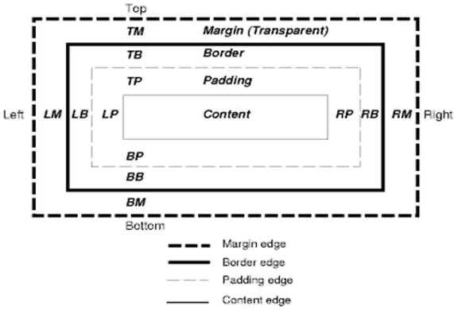
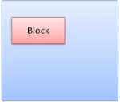
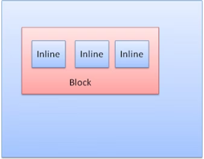
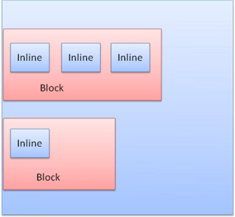
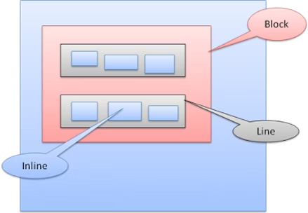
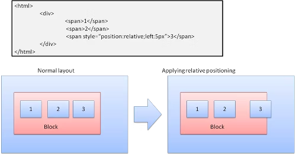
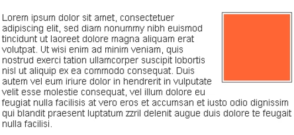
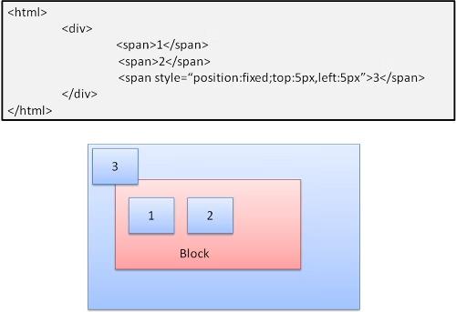
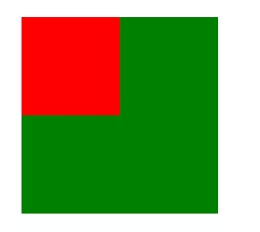

# 揭秘现代浏览器的渲染引擎（四）

声明 1：

> 本文翻译自  [How browsers work](https://web.dev/howbrowserswork/)
> 个人理解翻译可能会出现偏差，有兴趣请翻阅原文

声明 2：

> 原文发表日期距今日已有十年，虽然内容可能已经过时，但是作为系统讲述浏览器渲染引擎内部原理的文章，我还是想要翻译一遍，供大家参考。

## 布局

当渲染器被创建并添加到树中时，它没有位置和大小。计算这些值的行为称为**布局**(layout)或**重排**(reflow)。

HTML 基于流的布局模型，这意味着大多数情况下可以一次性计算出几何图形。在流中靠后的元素通常不会影响靠前元素的几何图形。因此文档布局可以从左到右，从上到下。但也有例外：HTML 中的 table 可能需要一次以上的处理。

坐标系是基于根渲染器的，使用 top 和 left 的坐标。

布局是一个递归的过程，从根渲染器开始，对应 HTML 文档中的 `<html>` 元素。布局工作通过部分或全部的框架层次继续递归，为每个需要几何信息的渲染器计算几何信息。

根渲染器的位置是 `0,0`，它的尺寸是 `viewport` — 浏览器的可视区域

所有的渲染器都有一个 `layout` 或 `reflow` 方法，每个渲染器调用其需要布局的子渲染器的 `layout` 方法

### `Dirty bit` 系统

为了不对每个小的变化都做一个完整的布局，浏览器使用一个 `dirty bit` 系统，更新或者添加的渲染器将自身标记为 `dirty`：需要布局

这里有两个标记：`dirty` 和 `children are dirty`（渲染器本身是没问题的，但是它至少有一个子元素需要布局）

### 全局和增量布局

布局可以在整个渲染树上触发，这是“全局”布局。造成这种原因的可能性有：

- 影响所有渲染器的全局样式更改，例如更改字体
- 调整了屏幕大小

布局也可以是增量的，只有标记为 `dirty` 的渲染器会被布局

当渲染器标记为 `dirty` 的时候，会触发（异步触发）增量布局。例如，当从网络获取的额外内容添加到 DOM 树时，新的渲染器将被追加到渲染树中。

### 异步和同步布局

增量布局时异步完成的，Firefox 将增量布局 `重排(reflow)命令` 排队，一个调度器会触发这些命令的批量执行。Webkit 也有一个执行增量布局的计时器，树被遍历，然后 `dirty` 渲染器被布局出来。

询问样式信息的 script （例如 `offsetHeight`），可以同步触发增量布局。

通常会同步触发全局布局

有时布局会在初始布局之后作为回调触发，因为某些属性（例如滚动）发生了变化。

### 优化

当布局被 `resize` 或更改渲染器位置（不是大小）触发时，渲染器大小从缓存中获取，而不是重新计算。

在某种情况下，只修改子树，布局不从根开始。这种情况可能发生在修改自身（并在不影响其他元素）的情况下，例如插入到文本字段中的文字（其他情况每个按键都会触发一个从跟渲染器开始的布局）。

### 布局过程

布局通常有以下模式(pattern)：

- 父渲染器确定自己的宽度
- 父渲染器检查子渲染器：
	- 放置子渲染器（设置 x 和 y）
	- 如果子渲染器是 `dirty` 或，我们在一个全局布局中（或者其他原因）需要计算子渲染器的高度的时候，调用子渲染器 `layout` 方法
- 父级使用子级的累计高度以及 `margin` 和 `padding` 来设置自己的高度（这将会被父级的父级所使用）
- 将其 `dirty` 设置为 `false`

Firefox 使用 `state` 对象(nsHTMLReflowState)，作为布局（它称为重排，reflow）的参数

Firefox 布局的输出是一个 `metrics` 对象(nsHTMLReflowMetrics)，它将会包含渲染器计算好的高度。

### 宽度计算

渲染器的宽度是使用容器块的 `width`，和渲染器样式的 `width` 属性以及 `margin` 和 `border` 计算的。

例如下面 div 的宽度

```html
<div style="width: 30%"/>
```

将由 Webkit 按照如下方式计算（`RenderBox` 类的 `calcWidth` 方法）

- 容器宽度是可用容器的最大宽度和 0。本例中的可用宽度是 `contentWidth` ，计算方式如下：

```cpp
clientWidth() - paddingLeft() - paddingRight()
```

`clientWidth` 和 `clientHeight` 表示对象的内部，不包含边框和滚动条。

- 元素的 width 是 `width` 样式属性，它通过计算容器的百分比作为绝对值来参加计算最终宽度
- 现在添加水平 `border` 和 `padding`

到目前为止，计算出来的宽度是首选宽度`preferred width`。现在开始计算最小宽度和最大宽度。

如果首选宽度大于最大宽度，那么使用最大宽度，反之若小于最小宽度，使用最小宽度。

这些值被缓存起来，以备需要布局时使用（宽度不会改变的情况下）。

### 行中断(breaking)

当布局中的某个渲染器决定需要中断时，该渲染器就会停止，并向其父级传递需要中断的信息。父节点将会创建额外的渲染器，并调用 `layout`。

## 绘制(painting)

在绘制阶段，遍历渲染树并调用渲染树的 `paint` 方法在屏幕中显示内容。绘制使用 UI 基础结构组件。

### 全局和增量

与布局一样，绘制也可以是全局的（整棵树都会被绘制）或者是增量的。

在增量绘制中，一些渲染器的更改不会影响整棵树的时候，更改后的渲染器将使其在屏幕中的矩形无效。于是操作系统将其视为一个 `dirty` 区域，并生成一个 `paint` 事件。操作系统会很聪明，可以将多个区域合并为一个。

在 Chrome 中，渲染器处于与主进程不同的进程中，所以更加复杂。Chrome 在一定程度上模拟了操作系统的行为，`presentation` 侦听这些事件，并将消息委托给根渲染器。然后遍历树，直到到达相关的渲染器。他会重绘(repaint)自己（通常是自己的子级）。

### 绘制优先级

[CSS2](https://www.w3.org/TR/CSS21/zindex.html) 定义了绘制的顺序。这实际上是元素在堆叠上下文中堆叠的顺序。这个允许影响绘制，因为栈是从后往前绘制的。块渲染器的堆叠顺序是：

- background color
- background image
- border
- 子级
- outline

### Firefox 的显示(display)列表

Firefox 遍历渲染树，并为绘制的矩形建立一个渲染列表。它包含了与矩形相关的渲染器，按照正确的绘制顺序（渲染器的背景，然后是边框等等）

这样，树只需要遍历一次而非多次就可以重绘，绘制所有的背景，然后是所有的图片，然后是所有的边框等等。

Firefox 通过不添加隐藏的元素（比如完全隐藏在其他不透明元素之下的元素）来优化这个过程。

### Webkit 矩形储存器

在重新绘制之前，Webkit 将旧矩形保存为位图(bitmap)。然后只绘制新旧矩形之间的差值。

### 动态变化

浏览器试图对一个变化做最小的反应。因此，元素颜色的变化只会导致该元素的重绘。元素位置的变化将导致该元素、其子元素以及可能的同级元素的布局和重绘。添加一个DOM节点将导致该节点的布局和重绘。

重要的更改，如增加 `html` 元素的字体大小，将导致缓存失效，重新布局和绘制整棵树。

### 渲染引擎的线程

渲染引擎是单线程的。除了网络操作之外，几乎所有的事情都发生在一个线程中。在 Firefox 和 Safari 中，这是浏览器的主线程，在 Chrome 中，这是一个 tab 标签页的主线程。

网络操作可以由多个并行线程执行，并行的数量是有限的（通常是 2 - 6 个）。

### 事件循环

浏览器主线程是一个事件循环。这是保持进程活跃的无线循环。它等待事件（如布局和绘制事件）并处理它们。这是主线程循环中 Firefox 的代码

```cpp
while (!mExiting)
    NS_ProcessNextEvent(thread);
```

## CSS 2 可视化模型

### canvas

根据 CSS2 规范，`canvas` 一词描述的是 "渲染格式结构的空间"：浏览器在这里画出内容。

canvas 在空间的每个维度上都是无限的，但浏览器会根据视口的尺寸选择一个初始宽度。

如果一个 canvas 包含在另一个 canvas 中，是透明的。如果不包含在另一个 canvas 中，则给定一个浏览器定义的颜色。

### CSS 盒子模型

CSS 盒子模型描述为文档树中的元素生成的矩形盒子，并根据可视化格式模型进行布局。

每个盒子都有一个内容区域（例如文本、图像等）和可选的 `padding` 、`border` 、和 `margin`。



图：CSS2 盒子模型

每个节点生成 0 - n 个这样的盒子。

所有的元素都有一个 `display` 属性，用于确定将要生成的盒子的类型。

例子：

```
block: 生成一个块盒子.
inline: 生成一个或多个内联盒子.
none: 不生成盒子.
```


默认值是 `inline`。但是浏览器样式表可以设置其他的默认值，例如 `div` 的默认值就是 `block`。

你可以在 [这里](https://www.w3.org/TR/CSS2/sample.html)找到一些示例。

### 定位方案

有三种方案：

- 标准：对象根据在文档中的位置定位。这意味着它在渲染树中的位置就是在 DOM 树种的位置，根据它的盒子类型和尺寸进行布局
- 浮动(float)：对象首先像正常的流式布局，然后移动到尽可能远的左边或者右边
- 绝对(absolute)：对象被放在渲染树和 DOM 树中的不同位置

定位方案由 `posotion` 和 `float` 指定：

- `static` 和 `relative` 会导致正常流
- `absolute` 和 `fixed` 回导致绝对定位

在 `static` 定位中，不定义位置，使用默认定位。在其他方案中，使用 `top`、`left`、`right`、`bottom` 定位。

盒子的摆放方式取决于：

- 盒子类型
- 盒子尺寸
- 定位方案
- 外部信息，如图像大小和屏幕大小

### 盒子类型

块盒子：形成一个块，在浏览器窗口中有自己的矩形：



图：块盒子

内联盒子：没有自己的块，但在一个容器块中：


图：内联盒子

块是一个接着一个垂直格式化的，内联盒子是水平格式化的：


图：块盒子和内联盒子

内联盒子被放在行里面或“行盒子”里。这些行至少和最高的盒子一样高，但也可以更高，当这些盒子以**基线**对其时，这意味着一个元素被排列在另一个盒子的某一点，而不是底部。如果容器的宽度不够，那么内联盒子将会被放在几行中。这通常是发生了一个段落中。




### 定位

#### relative 相对定位

定位像正常流一样，然后移动需要的差值



#### floats 浮动

将一个浮动的盒子移动到直线的左侧或右侧。有趣的是，其他盒子围绕着它流动。

HTML：

```html
<p>
  
  Lorem ipsum dolor sit amet, consectetuer...
</p>
```

会是这样的：



#### absolute 绝对和 fixed 固定

布局和正常的流不同，元素不参与正常流。尺寸是相对于容器的。在 fixed 的情况下，容器就是视口。



> 即使是滚动文档，fixed 的元素也不会移动


### 分层表示

这是由 `z-index` 属性指定的，它表示盒子沿着 z 轴的位置。

盒子被分为几个栈（称为栈上下文）。在每个栈中，将首先绘制后面的元素，前面的元素在上面，离用户更近。在重叠的情况下，最前面的元素将会覆盖后面的元素。

栈根据 `z-index` 属性进行排序，具有 `z-index` 属性的盒子形成一个自身栈。视口则有外部栈。

例如：

```html
<style type="text/css">
  div {
    position: absolute;
    left: 2in;
    top: 2in;
  }
</style>

<p>
  <div
    style="z-index: 3;background-color:red; width: 1in; height: 1in; ">
  </div>
  <div
    style="z-index: 1;background-color:green;width: 2in; height: 2in;">
  </div>
</p>
```


结果将是这样的：



尽管红色 div 在标记中位于绿色 div 之前，并且在常规流中之前已经绘制，但是 z-index 属性更高，因此它在根盒子中的栈中位置更靠前。