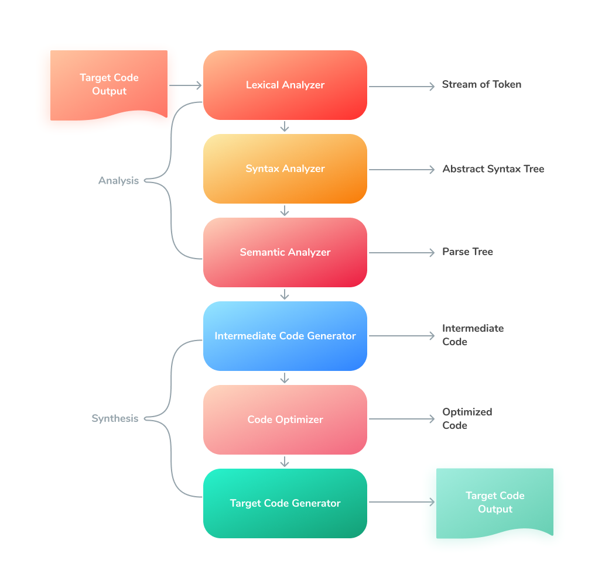

# 深入 JS 引擎（一）

声明：

> 本文翻译自  [Inside JavaScript Engines](https://medium.com/@yanguly/inside-javascript-engines-part-1-parsing-c519d75833d7)
> 个人理解翻译可能会出现偏差，有兴趣请翻阅原文

正文：

> JavaScript 现在已经非常流行了。“编写一次，到处运行”。——这是 JS（不是 Java！）但是“到处运行”的背后是什么？V8、SpiderMonkey、JavaScript Core，以及更多的引擎。Nashorn 和 Rhino是 "到处运行 "的一个很好的例子，但你有没有听说过这些基于Java虚拟机的引擎？

让我们更加深入地了解 JS 引擎，以及他们是如何工作的

## Part1: 解析(Parsing)


在漫长而又疲惫的[浏览器大战](https://en.wikipedia.org/wiki/Browser_wars)之后，还剩下 3 个主要的 JS 引擎：


其中一个是由 Google 支持的 [V8](https://v8.dev/)，它被用作于 Chrome 和 [Node.js](https://nodejs.org/en/) 运行环境。它支持 [现代 EcmaScript](https://www.ecma-international.org/publications-and-standards/standards/ecma-262/) ，有一个相当新的基准编译器，可以更快地启动 JavaScript(Sparkplug)，由 [垃圾回收](https://v8.dev/blog/orinoco-parallel-scavenger)，支持 [WebAssembly](https://v8.dev/docs/wasm-compilation-pipeline)，并进行广泛的代码优化工作。

V8 的编译流水线有 3 个编译器（以后还会有一个低延迟的 TurboProp）。

- [Ignition](https://docs.google.com/presentation/d/1OqjVqRhtwlKeKfvMdX6HaCIu9wpZsrzqpIVIwQSuiXQ/edit#slide=id.g1357e6d1a4_0_58): V8 的解释器(interpreter)，从编译器到字节码
- Sparkplug: 从字节码到机器码的未优化编译
- [TurboFan](https://v8.dev/blog/turbofan-jit): 从字节码到机器码的优化编译，现在已经可以直接对 Sparkplug 进行优化了


图：V8 编译流水线

还有一个由 Firefox 支持的的 **SpiderMoneky**。它被用于 Mozilla Firefox、[MongoDB](https://engineering.mongodb.com/post/code-generating-away-the-boilerplate-in-our-migration-back-to-spidermonkey)、CouchDB 和 Gnome（是的，它比 V8 出现的要早）。

这个 JS 引擎有一个非常棒的流水线，它们可以让这个引擎启动 JS 非常快。它有一个快速的带有编译器的解释器，可以产生未优化的代码。而且，在它运行时，优化编译器可以做自己的工作，来优化热点代码。此外，它还有一个垃圾回收器，可以和 WebAssembly  一起工作。


图：SpiderMonkey 编译流水线

最后一个是 JavaScript Core(JSC)。这是 Webkit 内置的 JS 引擎。作为一个很好的例子，它被用作与 Safari 和 IOS 的浏览器。JSC 的最新版本支持 ECMA 2021。

它是一个优化的虚拟机，有多个组成部分：

- 词法分析器(lexer)
- 解析器(parser)
- 启动解释器(LLInt)
- 基准 JIT
- 低延迟优化 JIT(DFG)
- 高吞吐量 JIT(FTL)

因此，它有四层编译。也许，随着 TurboProp 低延迟优化编译器的引入，V8 以后也会有。JSC 也存在垃圾回收器。


图：JSC 的编译流水线

### 值得一提的是

[React Native](https://reactnative.dev/docs/hermes) 使用的是 [Hermes 引擎](https://hermesengine.dev/)它是为优化 React Native 功能而建立的，内存使用率低，提供超前静态优化，以及紧密的字节码。

[JerryScript 引擎](https://github.com/jerryscript-project/jerryscript) 超级轻量，用于物联网。它可以工作在低内存的设备上，而且它的大小不超过 200 kb。

---

### 理论部分

什么是编译器(Parser)？什么是解释器(Interpreter)？

编译器是将代码从一种编程语言（像是 Python、Java、JavaScript 等）转换为另一种编程语言（如低级的机器指令或虚拟器码）。

有几种类型的编译器，举个例子：transpiler，它将一种高级编程语言转换为另一种高级编程语言，[TSC](https://www.typescriptlang.org/docs/handbook/compiler-options.html) ，TypeScript 的编译器就是一个很好的例子。它将 TypeScript 编译为 JavaScript。

编译器和解释器主要的区别在于：解释器逐行遍历代码并执行，而编译器执行之前先准备代码。

有一个东西介于它们两个之间。那就是实时(Just-In-Time, JIT) 编译器，在 JavaScript 等动态语言的引擎之间非常流行。

为了提高效率，JIT 编译器需要获取剖析信息来知道它需要多积极的优化代码。

"JIT 编译", 维基百科：

> 在[计算机技术](https://zh.wikipedia.org/wiki/%E8%AE%A1%E7%AE%97_(%E8%AE%A1%E7%AE%97%E6%9C%BA%E7%A7%91%E5%AD%A6))中，**即时编译**（英语： just-in-time compilation，缩写为 **JIT**；又译 **及时编译** [1](https://zh.wikipedia.org/wiki/%E5%8D%B3%E6%99%82%E7%B7%A8%E8%AD%AF#cite_note-1)、 **实时编译** [2](https://zh.wikipedia.org/wiki/%E5%8D%B3%E6%99%82%E7%B7%A8%E8%AD%AF#cite_note-2)），也称为 **动态翻译**或**运行时编译** [3](https://zh.wikipedia.org/wiki/%E5%8D%B3%E6%99%82%E7%B7%A8%E8%AD%AF#cite_note-3)，是一种执行 [计算机代码](https://zh.wikipedia.org/wiki/%E8%AE%A1%E7%AE%97%E6%9C%BA%E4%BB%A3%E7%A0%81 "计算机代码")的方法，这种方法涉及在程序执行过程中（在[执行期](https://zh.wikipedia.org/wiki/%E5%9F%B7%E8%A1%8C%E6%9C%9F "执行期")）而不是在执行之前进行[编译](https://zh.wikipedia.org/wiki/%E7%B7%A8%E8%AD%AF%E5%99%A8 "编译器")。[4](https://zh.wikipedia.org/wiki/%E5%8D%B3%E6%99%82%E7%B7%A8%E8%AD%AF#cite_note-FOOTNOTEAycock2003-4) 通常，这包括 [源代码](https://zh.wikipedia.org/wiki/%E6%BA%90%E4%BB%A3%E7%A0%81 "源代码")或更常见的[字节码](https://zh.wikipedia.org/wiki/%E5%AD%97%E8%8A%82%E7%A0%81 "字节码")到[机器码](https://zh.wikipedia.org/wiki/%E6%9C%BA%E5%99%A8%E8%AF%AD%E8%A8%80 "机器语言")的转换，然后直接执行。实现 JIT 编译器的系统通常会不断地分析正在执行的代码，并确定代码的某些部分，在这些部分中，编译或重新编译所获得的加速将超过编译该代码的开销。

>JIT 编译是两种传统的机器代码翻译方法 —— [提前编译](https://zh.wikipedia.org/w/index.php?title=%E6%8F%90%E5%89%8D%E7%BC%96%E8%AF%91&action=edit&redlink=1)（AOT）和[解释](https://zh.wikipedia.org/wiki/%E7%9B%B4%E8%AD%AF%E5%99%A8 "解释器") —— 的结合，它结合了两者的优点和缺点。[4](https://zh.wikipedia.org/wiki/%E5%8D%B3%E6%99%82%E7%B7%A8%E8%AD%AF#cite_note-FOOTNOTEAycock2003-4) 大致来说，JIT 编译，以解释器的开销以及编译和链接（解释之外）的开销，结合了编译代码的速度与解释的灵活性。JIT 编译是 [动态编译](https://zh.wikipedia.org/wiki/%E5%8B%95%E6%85%8B%E7%B7%A8%E8%AD%AF "动态编译")的一种形式，允许[自适应优化](https://zh.wikipedia.org/w/index.php?title=%E8%87%AA%E9%80%82%E5%BA%94%E4%BC%98%E5%8C%96&action=edit&redlink=1)，比如[动态重编译](https://zh.wikipedia.org/wiki/%E5%8A%A8%E6%80%81%E9%87%8D%E7%BC%96%E8%AF%91 "动态重编译")和特定于[微架构](https://zh.wikipedia.org/wiki/%E5%BE%AE%E6%9E%B6%E6%A7%8B "微架构")的加速 [注释1](https://zh.wikipedia.org/wiki/%E5%8D%B3%E6%99%82%E7%B7%A8%E8%AD%AF#cite_note-5)[5](https://zh.wikipedia.org/wiki/%E5%8D%B3%E6%99%82%E7%B7%A8%E8%AD%AF#cite_note-6)—— 因此，在理论上，JIT 编译比静态编译能够产生更快的执行速度。解释和 JIT 编译特别适合于 [动态编程语言](https://zh.wikipedia.org/wiki/%E5%8A%A8%E6%80%81%E8%AF%AD%E8%A8%80 "动态语言")，因为运行时系统可以处理[后期绑定](https://zh.wikipedia.org/w/index.php?title=%E5%90%8E%E6%9C%9F%E7%BB%91%E5%AE%9A&action=edit&redlink=1)的数据类型并实施安全保证。

传统的编译有两个步骤：

- 分析(Analysis) 步骤
- 合成(Synthesis) 步骤

让我们来仔细研究一下分析步骤：

中间产物在这一步后被创建，在我们的例子中，中间产物是抽象语法树(AST)。

它有几个阶段：



1. 词法分析 Lexical Analysis
   也被叫做扫描器(scanner)。它从源代码中提取字符并将它们分组为[词位](https://zh.wikipedia.org/wiki/%E8%AF%8D%E4%BD%8D)，对应于 Token。它会删除注释和空格。通常情况下，它接收处理程序的输出（指执行文件和宏扩展的程序）。
   [很棒的词法分析器的文章](https://www.tutorialspoint.com/compiler_design/compiler_design_lexical_analysis.htm)
2. 语法分析 Syntax Analysis
   也被叫做解析器(parser)。它构造解析树(Parse Tree)或语法树(Syntax Tree)。
3. 语义分析 Semantic Analysis
   它检查解析树，验证，并生成经过验证的解析树。它也会执行不同的检查，类似于：类型检查、控制流检查和标签检查。

综合步骤通常以一个结果程序结束。一些低级的、可以运行的程序。它有3个部分。

- 中间代码生成器
  生成可以转译为机器码的中间代码。中间代码的表现可以有多种形式，例如三地址码(three-address code)，3AC、TAC，与语言无关。或者字节码。
  **三地址码**：中间代码。用于优化编译器。这是一个高级汇编，每个操作只有三个操作数。[维基百科](https://zh.wikipedia.org/wiki/%E4%B8%89%E4%BD%8D%E5%9D%80%E7%A2%BC)
  **字节码**：虚拟机或编译器的中间代码。它是一种紧凑的数字代码（通常是人类无法阅读的）、常量和引用。字节码由软件处理，而不是硬件。[维基百科](https://zh.wikipedia.org/wiki/%E5%AD%97%E8%8A%82%E7%A0%81)
- 代码优化器
  使潜在的目标代码更快、更有效
- 代码生成器
  生成可以在特定机器上运行的目标代码。

---

### JS 分析的流程

通过 V8 引擎的例子来进一步了解 JS 分析的步骤。


图：V8 最新的代码解析流水线

#### 我们需要做什么来执行 JS 代码？

[“Blazingly fast parsing, part 1: optimizing the scanner](https://v8.dev/blog/scanner), V8 blog”:

> 要了运行一个 JS 程序，需要对源文本进行处理，以便 V8 能够理解。V8 首先将源代码解析为一棵抽象语法树。这是一组代码程序的结构对象。
> 该 AST 将会通过 Ignition 转译为字节码。

一般来说，执行 JS 需要以下步骤：

- 解析代码生成抽象语法树
- 编译已解析的代码（通常由一个基准和一个优化的编译器完成）

执行 JS 代码的第一步是解析代码，解析器生成数据结构 **AST** 和 **Scoop**。

- 抽象语法树(Abstract Syntax Tree, AST)：是 JavaScript 代码语法结构的树形表示。
- Scope 是另一个维护变量代理的数据结构。它有助于管理函数中变量的范围和引用。解析直接影响 JS 启动性能。

正如我之前在编译理论部分提到的，解析分为两个步骤 **词法分析** 和 **语法分析**。

**词法分析**涉及到从代码中读取字符流并将其组成为 Token。它还涉及到删除空白字符、注释等等。最后，整个代码串将被分割为一个 Token 的列表。

**语法分析**，也被成为解析，将在词法分析后获得一个简单的 Token 列表。并将其转为树状结构，同时也检测语言的语法。


V8 的解析器(Parser)消费由扫描器(Scanner)提供的 Token。Token 是由一个或多个具有单一语义的字符组成的块：一个字符串、一个标识符、一个像 `++` 这样的操作符。扫描器通过组合底层字符流中的多个连续字符来构建这些 Token。

扫描器消耗一个 Unicode 字符流。这些字符总是从 UTF-16 编码的字符流中解码。只支持一种编码，以避免不同版本的分析器和扫描器使用多种编码。

[“Blazingly fast parsing, part 1: optimizing the scanner](https://v8.dev/blog/scanner), V8blog”:

> Token 可以由各种类型的空白字符分割，例如：换行、空格、制表符=单行注释、多行注释等。一种类型的空白字符可以由其他类型的空白字符所跟随。如果空白字符导致两个 Token 之间断行，就会添加意义，这可能会导致[自动添加分号](https://tc39.es/ecma262/#sec-automatic-semicolon-insertion)。

V8 的扫描器可以有效地处理空白并添加分号。但是不要忘记缩小你的生产代码。如果需要的话，尽可能的添加分号。

---

最常见，也是最复杂的是 [标识符(Identifier)](https://tc39.es/ecma262/#prod-Identifier) Token，它被用作 JS 中的变量名。

多数的 JS 代码由 ASCII 写的，只有 `a-z`、`A-Z`，`$`, `_` 是 `ID_Start` 字符。

`ID_Continue` 还包含 0-9。这就意为这 JS 的变量名从 `a-zA-z$_` 开始，后面可以有 `0-9` 字符

```js
const someVariable1 = 'example1'
const some_variable$ = 'example2'
```

使用较短的标识符有利于提高程序的解析性能，扫描器能够每秒扫描更多的 Token，但是...

由于 JS 代码经常被压缩混淆，V8 使用了一个简单的查找表来查找单个 ASCII 字符的字符串。所以V8是为最压缩混淆的代码而构建的，你可以保留你的长变量名，但一定要确保你的代码被压缩混淆。

#### 简短的结论

提高扫描性能的最简单的办法就是简化你的源代码，去除不必要的空白字符，并尽可能的避免使用非 ASCII 的字符。理想情况下，这些步骤是作为构建过程一部分自动进行的。

更多 V8 扫描器的信息：[Blazingly fast parsing, part 1: optimizing the scanner](https://v8.dev/blog/scanner)

---

### V8 的解析

解析是将源代码转换为供编译器使用的中间产物的步骤。（在 V8 中，字节码编译器是 [Ingnition](https://v8.dev/blog/ignition-interpreter)）

解析和编译发生在网页启动的关键路径上。但并不是所有运行在浏览器的功能在启动时都是立刻需要的。虽然开发者可以使用 `async` 或者 `deferred` 来延迟代码的执行，但并不总会出现。

此外，许多网页的代码只被某些特性使用，而这些特性在网页的任何运行过程中都不会被用户访问。

因此，最好使用 defer 或者 lazy load 来加载启动时不需要的 JS 模块。而且，不要忘记对代码使用 [Tree-Shaking](https://webpack.js.org/guides/tree-shaking/)，为了获得更好的体验和懒解析，这是必需的功能。

---

一次不需要的源代码编译的开销是巨大的：

- 应用程序启动所需的代码的可用性将会被延迟
- 在[字节码刷新](https://v8.dev/blog/v8-release-74#bytecode-flushing) 决定不需要这些代码并允许其被垃圾回收之前，是在占用内存。
- 将占用磁盘空间进行代码缓存。

为了改进这一点，现代 JS 引擎正在进行延迟解析(lazy parsing)

V8 引擎有 [Pre-Parse](https://source.chromium.org/chromium/v8/v8.git/+/e3b2feb3aade83c02e4bd2fa46965a69215cd821:src/parsing/preparser.h;l=921)
一个解析器的副本，它做了最基本的工作，其他时候就可以跳过这个函数。// 预解析器检查语法是否符合 JavaScript 的语法，并收集关于程序的信息。语法检查只是为了充分理解程序，从而推断出一些相关的信息，这些信息可以加快后面的解析。

#### 优化立即执行函数 IIFE

一个立即执行函数(Immediately Invoked Function Expression, IIFE)，是 JS 的函数，定义了就会运行。

```js
(function () {
  let firstVariable
  let secondVariable
})()
```

打包器将模块包装为 IIFE，这些 IIFE 的危险之处在于，这些函数在代码执行的早期就立即需要，所以为这样的函数做准备并不理想。

V8 有两个简单的模式，它可以识别可能被调用的函数表达式（PIFE），在此基础上，它将立刻编译和解析一个函数。

- 如果一个函数的带括号的表达式，例如 `(function() {})()`，V8 假定它将被调用，只要看到 `(function` 的开始，V8 都会做出这个假设。
- V8 还检测由 [UglifyJS](https://github.com/mishoo/UglifyJS) 生成的模式：`!function(){…}(),function(){…}(),function(){…}()`

由于 V8 急切编译 PIFE，他们可以作为[profile-directed feedback](https://en.wikipedia.org/wiki/Profile-guided_optimization) ，告知浏览器应用启动时需要哪些功能。

[profile-directed feedback](https://en.wikipedia.org/wiki/Profile-guided_optimization) 又被称为 **Profile-guided optimization(PGO)**。是一种被广泛使用的编译器优化技术，它使用剖析来提高性能。

通常情况下，它从静态程序分析开始（不运行源代码，相反的是**动态分析**）

分析甚至可以进行[循环展开](https://zh.wikipedia.org/wiki/%E5%BE%AA%E7%8E%AF%E5%B1%95%E5%BC%80) —— 循环转换，通过减少或者消除控制循环的指令，如指针运算和每次迭代的 "循环结束 "测试。 减少分支惩罚；以及隐藏延迟，包括从内存读取数据的延迟。

现代的 **profile-guided optimization** 可以同时使用静态分析和动态分析。并动态的重新编译部分代码。

**解析代码的示例**

让我们来看一段简单的代码：

```js
const array = [1, 2, 3, 4]

array.reduce((previousValue, currentValue) => previousValue + currentValue)
```

AST 结果如下：

```
[generating bytecode for function: ]
--- AST ---
FUNC at 0
. KIND 0
. LITERAL ID 0
. SUSPEND COUNT 0
. NAME ""
. INFERRED NAME ""
. DECLS
. . VARIABLE (0x12385e690) (mode = CONST, assigned = false) "array"
. BLOCK NOCOMPLETIONS at -1
. . EXPRESSION STATEMENT at 14
. . . INIT at 14
. . . . VAR PROXY context[2] (0x12385e690) (mode = CONST, assigned = false) "array"
. . . . ARRAY LITERAL at 14
. . . . . VALUES at 14
. . . . . . LITERAL 1
. . . . . . LITERAL 2
. . . . . . LITERAL 3
. . . . . . LITERAL 4
. EXPRESSION STATEMENT at 29
. . ASSIGN at -1
. . . VAR PROXY local[0] (0x12385ecb0) (mode = TEMPORARY, assigned = true) ".result"
. . . CALL
. . . . PROPERTY at 35
. . . . . VAR PROXY context[2] (0x12385e690) (mode = CONST, assigned = false) "array"
. . . . . NAME reduce
. . . . FUNC LITERAL at 42
. . . . . LITERAL ID 1
. . . . . NAME 
. . . . . INFERRED NAME 
. RETURN at -1
. . VAR PROXY local[0] (0x12385ecb0) (mode = TEMPORARY, assigned = true) ".result"

[generating bytecode for function: ]
--- AST ---
FUNC at 42
. KIND 11
. LITERAL ID 1
. SUSPEND COUNT 0
. NAME ""
. PARAMS
. . VAR (0x12385e858) (mode = VAR, assigned = false) "previousValue"
. . VAR (0x12385e908) (mode = VAR, assigned = false) "currentValue"
. DECLS
. . VARIABLE (0x12385e858) (mode = VAR, assigned = false) "previousValue"
. . VARIABLE (0x12385e908) (mode = VAR, assigned = false) "currentValue"
. RETURN at 89
. . ADD at 89
. . . VAR PROXY parameter[0] (0x12385e858) (mode = VAR, assigned = false) "previousValue"
. . . VAR PROXY parameter[1] (0x12385e908) (mode = VAR, assigned = false) "currentValue"
```

相当大！我使用了 [D8](https://v8.dev/docs/d8)来做 V8 的本地构建。

```bash
d8 — print-ast reduce.js > reduce-ast.txt
```

解析通常占整个编译时间的 15% - 20%。而且未被压缩的代码的 AST 要比压缩过的代码的 AST 要大得多。使用压缩器（例如 UglifyJS），不要手动压缩你的代码。

同时，Chrome 还会在本地储存编译过的代码，以减少下一次应用程序的编译时间。

更多有关于 V8 编译器的信息：[Blazingly fast parsing, part 2: lazy parsing](https://v8.dev/blog/preparser)

### 进一步研究 SpiderMonkey 的解析器

是的，SpiderMonkey 也有惰性的（或者 syntax）解析。解析器创建 AST，由 BytecodeEmitter 使用。产生的格式使用 Script Stencils。由解析产生的关键解构是 ScriptStencils 实例。

Stencils 可以被实例化为一系列的垃圾回收器单元。这些单元可以被 mutated，并且被执行引擎所理解。

[Script Stencils](https://searchfox.org/mozilla-central/source/js/src/frontend/Stencil.h#75) 解释：

> Stencils 是捕获解析和字节码结果的一组数据结构。Stencil 格式是一种前导格式，然后用来在 GC 堆(heap) 上分配相应的脚本。这些脚本将用于执行。通过 GC 与其他运行时解耦，可以建立强大的缓存和推测系统，这些系统对线程的影响更大，也更灵活。

当一个懒解析的内部函数第一次被执行时，引擎只重新编译此函数，这个过程被称为 `delazification`。懒解析避免了分配 AST 和字节码，从而节省了 CPU 的时间和内存。在实践中，许多函数在网页特定加载过程中从未被执行，所以懒解析可能是相当有用的。

### JSC 的词法分析器(Lexer)和语法分析器(Parser)

当然 JSC 同时又词法分析器和解析器。

词法分析器做[词法分析 Lexical Analysis](https://zh.wikipedia.org/wiki/%E8%AF%8D%E6%B3%95%E5%88%86%E6%9E%90)工作，将源代码分解为 tokens。主文件：[parser/Lexer.h](https://trac.webkit.org/browser/trunk/Source/JavaScriptCore/parser/Lexer.h) 和 [parser/JSParser.cpp](https://trac.webkit.org/browser/trunk/Source/JavaScriptCore/parser/JSParser.cpp)

语法分析器做 [语法分析 Syntactic Analysis](https://zh.wikipedia.org/wiki/%E8%AF%AD%E6%B3%95%E5%88%86%E6%9E%90)工作。消费来自词法分析器的 Token 并构建语法树。JSC 使用了一个手写的递归下降分析器。代码在：[parser/JSParser.h](https://trac.webkit.org/browser/trunk/Source/JavaScriptCore/parser/JSParser.h) 和 [parser/JSParser.cpp](https://trac.webkit.org/browser/trunk/Source/JavaScriptCore/parser/JSParser.cpp)

下一步是 LLInt，低级别的解释器。它可以在零启动时间的情况下处理来自语法分析器的代码。

你可以在[这里](https://trac.webkit.org/wiki/JavaScriptCore)和这个由 Assaf Sion 撰写的[故事](https://www.cyberark.com/resources/threat-research-blog/the-mysterious-realm-of-javascriptcore)中阅读更多关于 JSC 解析的内容。

## 结论：解析步骤

我们已经回顾了编译的解析步骤，以及它在不同的JavaScript引擎中是如何完成的。

你需要执行以下步骤来提高解析器的性能：

1. 延迟加载启动时不需要的模块
2. 移除不需要的模块
3. 使用 Devtools 来看查看性能瓶颈
4. 当然，压缩你的代码，你不再需要 Optimize.js 了，看[这里](https://v8.dev/blog/preparser#pife)V8 的博客。
5. 编译产物少一点

关于第 5 点，你可能需要先了解以下 Babel 或 TSC 在做什么。避免过多的空值检查和语法糖，这可能会产生过多的编译产物。尽可能的将编译版本设置为新的，避免过多的 polyfill。

即使有IIFEs的优化，也应该避免不必要地用小括号包装函数，因为这会导致更多的代码被尽早的编译，导致更差的启动性能和更多的内存使用。
