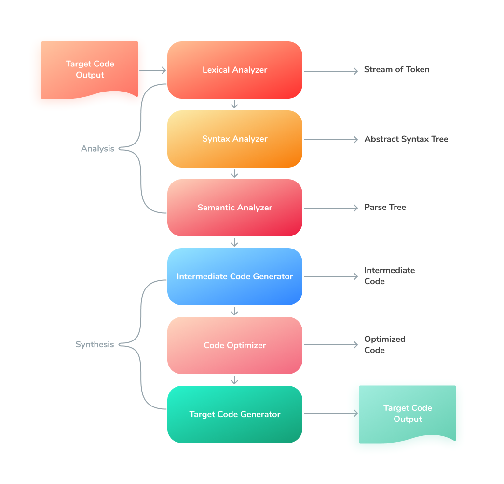
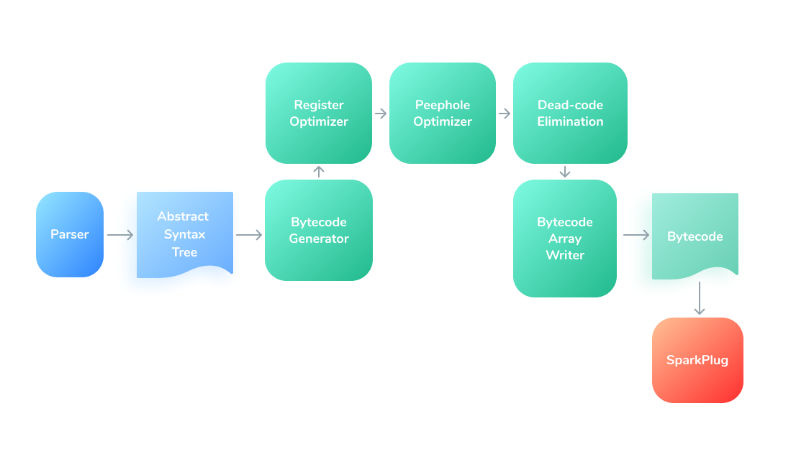
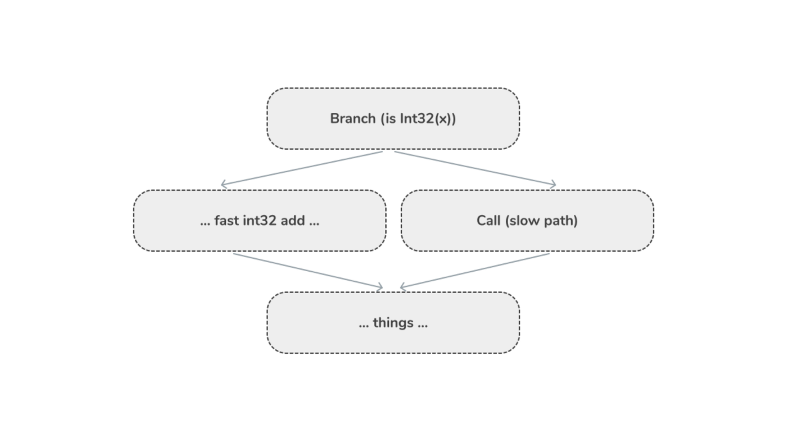
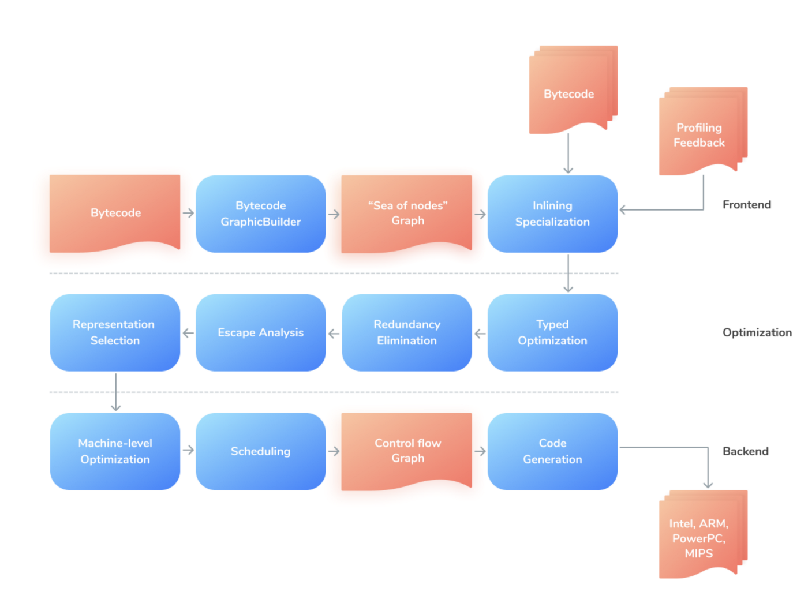
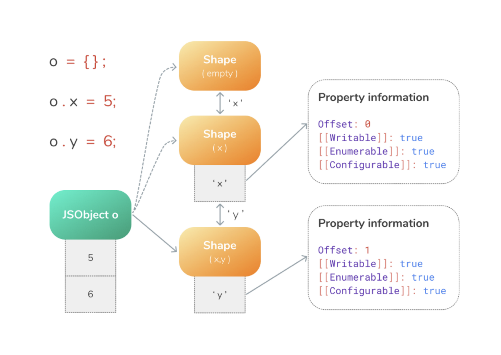
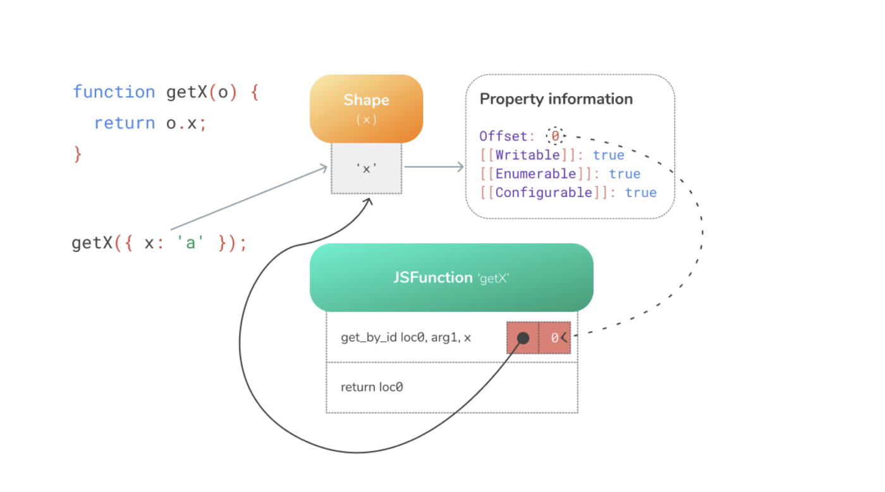
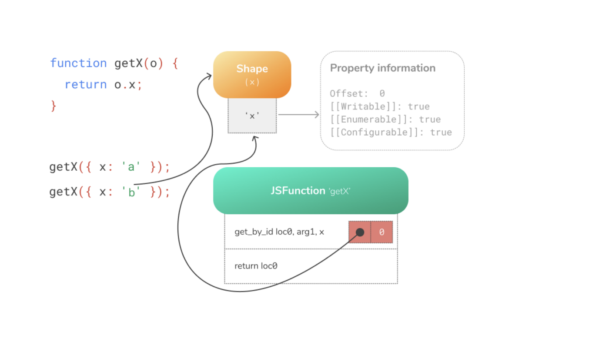

# 深入 JS 引擎（二）

> 声明：

> 本文翻译自  [Inside JavaScript Engines](https://medium.com/@yanguly/inside-javascript-engines-part-2-code-generation-and-basic-optimizations-952bed02db62)
> 个人理解翻译可能会出现偏差，有兴趣请翻阅原文

正文

**副标题**：代码生成和基础优化


图：Spidermonkey, Firefox 的引擎

正如我再第一部分提到的，传统的编译分为两步：

- 统计步骤
- 合成步骤



今天来研究第二步：合成。

合成步骤通常以一个结果程序结束，一些低等级的，可以运行的部分。它会有 3 个部分：

- 中间代码生成器
  生成可以翻译为机器码的中间代码。
  生成可以转译为机器码的中间代码。中间代码的表现可以有多种形式，例如三地址码(three-address code)，3AC、TAC，与语言无关。或者字节码。
  **三地址码**：中间代码。用于优化编译器。这是一个高级汇编，每个操作只有三个操作数。[维基百科](https://zh.wikipedia.org/wiki/%E4%B8%89%E4%BD%8D%E5%9D%80%E7%A2%BC)
  **字节码**：虚拟机或编译器的中间代码。它是一种紧凑的数字代码（通常是人类无法阅读的）、常量和引用。字节码由软件处理，而不是硬件。[维基百科](https://zh.wikipedia.org/wiki/%E5%AD%97%E8%8A%82%E7%A0%81)
- 代码优化器
  使目标代码更快，更有效

- 代码生成器
  生产可以运行在指定机器上的目标代码。

## 中间代码生成器

V8 有 Ignition，一个基于寄存器的低级的快速的解释器。

Ross McIlroy. “[Firing up the Ignition interpreter](https://v8.dev/blog/ignition-interpreter)”:

> Ignition 解释器使用 TurboFan 的低级、独立于架构的宏汇编指令，为每个操作码生成字节码处理程序。TurboFan 将这些指令编译到目标架构上，在此过程中进行低级指令选择和机器寄存器分配。



图：Ignition

[Ignition 文档](https://docs.google.com/document/d/11T2CRex9hXxoJwbYqVQ32yIPMh0uouUZLdyrtmMoL44/edit)

> 解释器本身由一组字节码处理程序代码片段组成，每个处理程序处理一个特定的字节码，并将其分配给下一个字节码的处理程序。这些字节码处理程序是以高水平的、与机器架构无关的汇编代码形式编写。由 CodeStubAssembly 类实现并由 Sparkplug 编译
>
> 为了将一个函数编译成字节码，JavaScript 代码首先会被编译以生成抽象语法树(AST)。BytecodeGenerator 浏览这个抽象语法树，并为每个 AST 生成适当的字节码。

SpiderMonkey 引擎有 C++ 解释器，与基准解释器一起生成中间代码。基准解释器几乎可以立即运行未优化的代码。

JSC: LLInt，低级解释器(Low-Level Interpreter)的缩写，执行解释器生成的字节码。但是我不能称之为“中间代码生成器器”，因为它生产机器代码。

## 非优化编译

引擎流水线的非优化编译的主要思想是什么？优化过的代码会工作的更好、更快、减少内存占用等等...

优化是一个需要时间和算力的过程，因此对于像加载网站或者命令行工具这种简短的 JavaScript 代码来说，不值得花费这些精力。另外，对优化过的代码去优化也是一种繁重的操作，会花费一些额外的时间。

所以，V8 有**Sparkplug**，它是一个转译器/编译器，将 Ignition 的字节码转换为机器码，将 JS 从在虚拟机/模拟器中运行转移到原生机器机器上运行。

**SpiderMonkey**有一个**基准解释器**，作为 JS 编译的中间步骤。这个基准解释器与 C++ 解释器和基准 JIT 一起做的更好。你可以在 [这篇文章](https://hacks.mozilla.org/2019/08/the-baseline-interpreter-a-faster-js-interpreter-in-firefox-70/) 中了解更多。

**JavaScript Core**有 4 个不同的编译器。第一个，LLInt，是非优化的，它结合了一个基准代码生成器和一个非优化的解释器。低级解释器的代码库在 llint/文件夹 中。LLint 是一种叫做 offlineasm 的可移植汇编器所编写的。LLInt 的目的是遵守即时(JIT)编译器所使用的调用、堆栈和寄存器惯例的情况下，除了词法和解析之外，启动成本为 0。

例如，调用一个 LLInt 函数时，“就像”该函数被编译为本地代码一样，只不过机器代码的实际入口点实际上是一个共享的 LLInt 序言(Prologue)。LLInt 包括基本的优化，如内联缓存，以确保快速的属性访问。

## 低强度优化编译(Low-Impact Optimizing Compilition)

有些函数的运行时间很短，为这些函数运行任何编译器的开销都比直接解释它们更大。有些函数被频繁调用，或者有很长的循环，它们的总执行时间要远远超过用编译器编译它们的时间。

但是也有很多函数处在这两者之间，它们的运行时间还没有足以需要使用编译器，但是又足够长。这样可以有一些中间编译器来提供速度上的提升·。

只有 **JavaScriptCore** 在其流程管道中存在最小优化编译器：**基准 JIT 和 DFG(Data Flow Graph, 数据流图) JIT**。

基准 JIT 做了一些基本的优化。他对至少被调用 6 次的函数，或者至少被循环 100 次的函数（或者是一些组合，比如调用 3 次，循环 50 次）进行工作。

如果 LLInt 卡在一个循环中，他将会通过**替换栈帧**(on-stack replacement, OSR) 的方式来替换为基准 JIT，基准 JIT 为每个字节码指令发送机器码模板，而不试图获得函数中多个指令之间的关系。它将编译整个函数，这将使其变成一个函数 JIT。Baseline 没有 OSR，但是确实有一些基于 LLInt 的钻石推测(Diamond Speculations)。

钻石推测(Diamond Speculations)意味着我们每次执行操作时，都有一个专门用于分析器告诉我们的快速路径和一个处理一般情况的慢速路径：



或者在伪代码中：

```
if (is int)
    int add
else
    Call(slow path)
```

**DFG(Data Flow Graph, 数据流图)** 则更具侵略性：

它对至少调用 60 次的函数，或者对一个至少循环 1000 次的函数工作。DFG 根据下层收集的信息来进行更加积极的类型推测。

DFG 可以根据 LLInt 、Baseline 的分析结果来进行 OSR 推测。在某种罕见的情况下，可以使用 DFG JIT 或者 FLT JIT 分析的结果。它可以通过 OSR 退出到 Baseline 或者 LLInt。

DFG 避免做开销很大的优化，做出很多妥协来保证代码快速生成。

V8 也有一些小秘密，它有 TurboProp 中间层编译器，但是被关闭了。这个是 TurboFan 的轻量化版本，关闭了一些重度优化，你可以在本地调试的时候打开。

```
DEFINE_BOOL(turboprop, false, "enable experimental turboprop mid-tier compiler")
```

可以在[这里](https://github.com/v8/v8/blob/9.4.117/src/flags/flag-definitions.h) 找到更多关于 V8 标记的信息

## 高强度优化编译(High-Impact Optimizing Compilition)

3 个引擎都有高强度优化编译器

V8 有 [TurboFan](https://v8.dev/docs/turbofan)，优化编译器，读取 Ignition 生成的字节码。它替换了老版本的 Full-Codegen。

TurboFan 有一个分层结构。它的通用性更强，代码库更小，存在抽象层，允许更轻松的优化和改善（针对更新的 ECMA 规范）。而且在那里添加特定机器的代码生成器也更简单（比如针对 IBM、ARM、Intel 架构的代码）。

TurboFan 的主要思想是[海量节点的中间表示法](https://docs.google.com/presentation/d/1Z9iIHojKDrXvZ27gRX51UxHD-bKf1QcPzSijntpMJBM/edit#slide=id.p)(Intermediate Representation, IR)。TurboFan 从 Ignition 中获取指令，对其进行优化，并生成指定平台的机器码。



图：TurboFan 的优化流水线

可以在这里 [“Launching Ignition and TurboFan” article](https://v8.dev/blog/launching-ignition-and-turbofan) 找到更多。

也可以看 [Ignition interpreter article](https://v8.dev/blog/ignition-interpreter), 还有 [V8 Ignition and TurboFan story](https://benediktmeurer.de/2017/03/01/v8-behind-the-scenes-february-edition)。

---

SpiderMonkey 有 [IonMonkey](https://wiki.mozilla.org/IonMonkey/Overview) 编译器。

IonMonkey 有两个主要目标：

- 拥有一个工程设计良好、易于支持添加新优化的设计。
- 允许生成极快的代码所需的特殊化。

为了支持目标 1，IonMonkey 有一个分层的、高抽象的体系结构。

为了支持目标 2，IonMonkey 取代了 tracing Baseline JIT 的位置。它支持对操作的效果和结果的乐观假设，并允许这些假设贯穿生成的代码。就像是一个追踪器(Tracer) 一样，这个需要守卫(Guard)。守卫是战略性的放置检查，如果检查失败，那么就会取消优化。

当一个守卫失败时，它会调用一个 Bailout。

IonMonkey 的编译分为 4 个阶段：

- [MIR 生成](https://wiki.mozilla.org/IonMonkey/MIR)：生成中间层的内部表述。这个阶段将 SpiderMonkey 的字节码转化为控制流图和独立于架构的[静态单一赋值形式](https://zh.wikipedia.org/wiki/%E9%9D%99%E6%80%81%E5%8D%95%E8%B5%8B%E5%80%BC%E5%BD%A2%E5%BC%8F)的内部表示。
- [优化](https://wiki.mozilla.org/IonMonkey/Optimization_passes)：对 MIR 进行分析和优化。这就是全域数值编号(Global Value Numbering, GVN) 和 [循环不变代码外提](https://zh.wikipedia.org/wiki/%E5%BE%AA%E7%8E%AF%E4%B8%8D%E5%8F%98%E4%BB%A3%E7%A0%81%E5%A4%96%E6%8F%90)(Loop-Invariant Code Motion, LLCM) 发生的地方。
- [下降](https://wiki.mozilla.org/IonMonkey/LIR#Lowering)：MIR 被转换为一个特定架构的 IR（但仍然是 SSA 的形式）叫做 LIR，或者低级的 IR(Low-Level IR)。寄存器分配发生在LIR上。LIR是平台特定的，对代码生成是必要的。
- [代码生成](https://wiki.mozilla.org/IonMonkey/Code_Generation)：LIR 被转换为 x86、 x64 或 ARM (或者其他类似的) 的原生程序集。

---

JavaScript Core 有 [FTL JIT](http://trac.webkit.org/browser/trunk/Source/JavaScriptCore/ftl)，或者叫做 Faster Than Light JIT。它为最大吞吐量而设计的，FTL 不会为了提高编译速度而牺牲吞吐量。这个 JIT 复用了很多 DFG JIT 的大部分优化，并增加了很多优化。FTL JIT 使用多个 IR(DFG IR, DFG SSA IR, [B3](https://webkit.org/docs/b3/) IR 和 Assembly IR)。

B3 编译器包含两种中间表示法：一种是基于 SSA 的高层表示法，称为 B3 IR。另一种是关注机器细节的底层表示法，寄存器。这种较低级别的形式被称为 [Air](https://webkit.org/docs/b3/assembly-intermediate-representation.html)(Assembly Intermediate Representation)。

B3 IR 和 Air 的设计已经为优化建立了良好的基础，B3 的优化器包含了很多优化功能：

[强度降低](http://trac.webkit.org/browser/trunk/Source/JavaScriptCore/b3/B3ReduceStrength.cpp?rev=195946)，其中包括：

- 控制流图的简化
- 积极的消除无用的代码
- 整数溢出检查消除
- 许多杂七杂八的简化消除

---

### 优化措施

想知道 JS 引擎是如何优化你的代码的吗？让我们来看一看：

**内联优化**

热点代码的流行优化：

#### 隐藏的类

是的，这个话题在几年前的 JS 讲座上非常流行。所有主要的引擎都以类似的方式实现了这一点。

ECMAScript 规范将所有对象定义为字典：

- 在 JS 程序中，通常会有多个键相同的对象
- 引擎正在创建隐藏的类，这些类被附加到每个对象上以追踪其信息。
- 这略微减少了属性访问的时间

当一个属性被添加到对象中时，旧的隐藏类会切换到一个新的隐藏类（其中包含了新的属性）。由于有两个不同的类，因为不能做内联缓存，引擎不能快速访问其属性。

小心 Bailout ！

- 向存在的对象添加属性。旧的隐藏类转换为带有新属性的新类
- 由于有两个不同的类，因为它不能做内联缓存，引擎不能快速访问其属性。



1. JsObject **o**  是一个空的隐藏类
2. 添加 **o.x** 键将会创建一个新的隐藏类携带键 **x**
3. 添加 **o.y** 键将会创建一个新的隐藏类携带键 **x** 和 **y**。

隐藏类在不同的引擎中有着不同的命名

- 隐藏类(**Hidden Classes**)，通用的名字
- V8 叫它为 **Maps**
- JavaScriptCore 叫它为 **Structures**
- SpiderMonkey 叫它为 **Shapes**

来看看 [这个](https://medium.com/swlh/writing-optimized-code-in-js-by-understanding-hidden-classes-3dd42862ad1d) 来获得有关隐藏类的更深的知识

#### 内联缓存，优化开销大的查找

隐藏类背后的主要原因是 **内联缓存**(Inline Cache) 的概念

[Mathias Bynens](https://twitter.com/mathias) 在他的文章中描述了这个： [JavaScript engine fundamentals: Shapes and Inline Caches](https://mathiasbynens.be/notes/shapes-ics).

简单描述：

JavaScript 引擎使用内联缓存来记忆哪里找到对象的属性信息，并减少开销大的查找次数。这有点像对象属性的捷径。

- 引擎会缓存你在方法调用中作为参数传递的对象的类型。
- 引擎使用这些信息来假定你将来作为参数提供的对象的类型。
- 如果这个假设是真的，引擎可以跳过对内存中真实对象属性的访问，而是返回缓存的值。

函数 `getX` 接收一个对象，并访问该对象的 `x` 属性：

```js
function getX(o) {
  return o.x
}
```

将会生成下面的字节码：



第一条指令 `get_by_id` 从第一个参数 `arg1` 加载属性 `x`，并将其储存到 `loc0` 中。第二条指令返回我们储存的 `loc0` 中的信息。

当你第一次执行该函数时，`get_by_id` 指令查找属性 `x`，发现该值被存储在 offset 0 处。

嵌入到 `get_by_id` 指令中的内联缓存记忆了隐藏类和找到属性的 offset。



对于后续的运行，内联缓存只需要比对隐藏类，如果和之前的一致，那么就可以直接从记忆过的 offset 中加载值。

具体来说，如果 JavaScript 引擎看到了内联缓存之前记录的具有隐藏类型的对象，它就完全不需要再去接触属性信息了，这样可以完全跳过开销大的属性信息查询。这比每次都要查询的速度要快得多。这使得 JS 引擎如此之快！

## 如果最有效的使用隐藏类？

1. 尝试在对象的构造函数中定义所有的属性
2. 如果你正在动态地给对象添加新的属性，请始终以相同的顺序实例化它们，以便隐藏的类可以在这些对象之间共享。
3. 尽量不要在运行时添加或者删除对象属性

## 扩展：Bailouts

如果动态检查失败，去优化器会将代码删除。

- 丢弃优化过的代码
- 从优化的堆栈中建立解释器框架。
- 切换到强度低的编译器

Bailouts 的一个简单的例子：

- 不是一个 Smi(Small Integer, 小整数)

再一次，让我们来看看一个 Dimond 猜测：


`fast int add` 操作对于平台来说是经过优化的，是 “原生(native)” 的。斗则，代码将会缓慢执行没有经过优化的操作。

## 有用的链接

我为你准备了一些额外的东西，主要是深度优化，V8引擎的调试构建，bailouts：

[https://github.com/yanguly/v8-playground](https://github.com/yanguly/v8-playground)
